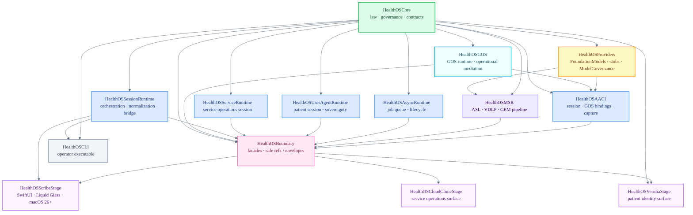

# HealthOS/

Canonical operational root for the HealthOS platform scaffold. This directory holds the buildable Swift package and the physical tier layout for Core law, GOS/runtimes, Boundary, Stages, shared assets, external construction tooling, and provider support.

Open `HealthOS.xcworkspace` or `HealthOS/Package.swift` in Xcode. From the terminal, use `cd HealthOS && swift build`.

External dependencies: none. Sovereignty by design.

The reorganization is structural only. It does not change runtime behavior, Core authority, provider maturity, regulatory readiness, or the non-production status of this repository.

```text
HealthOS/
  Tier1-Mestral-Core/       Core law, schemas, SQL, Core tests
  Tier2-GOS-Runtimes/       GOS, AACI, MSR, providers, runtime seams
  Tier3-Custom-Boundary/    Boundary facades and app-safe consumption surfaces
  Tier4-Stages-Cast/        Stage consumers: Scribe, Veridia, CloudClinic
  Constructor/             external Steward/Settler/Forge MCP construction system
  Support/                 provider support, ML scaffolds, ops, Python helpers
  Shared/                   docs, design system, fixtures, CLI, shared tests
  Xcode/                    test plans and Xcode-facing prompt packs
```

---

## Package Structure

Fifteen targets across Core, GOS/runtimes, Boundary, and Stage groups, plus the operator CLI.



---

## Module Reference

### Tier 1 — Core Law

| Module | README | Maturity |
| :--- | :--- | :--- |
| `HealthOSCore` | [README](Tier1-Mestral-Core/Sources/HealthOSCore/README.md) | Implemented seam |

Core law, governance invariants, entity model, storage contracts, consent/habilitation/gate/finality types, GOS type vocabulary, MSR runtime types.

---

### Tier 2 — Runtime / Mediation

| Module | README | Maturity |
| :--- | :--- | :--- |
| `HealthOSProviders` | [README](Tier2-GOS-Runtimes/Sources/HealthOSProviders/README.md) | Implemented seam |
| `HealthOSGOS` | [README](Tier2-GOS-Runtimes/Sources/HealthOSGOS/README.md) | Scaffold stub (migration from AACI pending) |
| `HealthOSAACI` | [README](Tier2-GOS-Runtimes/Sources/HealthOSAACI/README.md) | Implemented seam (bounded scope) |
| `HealthOSMSR` | [README](Tier2-GOS-Runtimes/Sources/HealthOSMSR/README.md) | Scaffold (executors present, provider integration pending) |
| `HealthOSAsyncRuntime` | [README](Tier2-GOS-Runtimes/Sources/HealthOSAsyncRuntime/README.md) | Scaffold stub |
| `HealthOSUserAgentRuntime` | [README](Tier2-GOS-Runtimes/Sources/HealthOSUserAgentRuntime/README.md) | Scaffold stub |
| `HealthOSServiceRuntime` | [README](Tier2-GOS-Runtimes/Sources/HealthOSServiceRuntime/README.md) | Scaffold stub |
| `HealthOSSessionRuntime` | — | Implemented seam |

---

### Tier 3 — Boundary

| Module | README | Maturity |
| :--- | :--- | :--- |
| `HealthOSBoundary` | [README](Tier3-Custom-Boundary/Sources/HealthOSBoundary/README.md) | Scaffold stub — facade pending Tier 2 stabilization |

The only surface Stages are permitted to import. Stages must never import Core, SessionRuntime, or any Tier 2 module directly. Known deviations (Veridia to Core, Scribe to SessionRuntime) are marked TODO in `Package.swift` pending Boundary facade completion.

---

### Operator CLI

`HealthOSCLI` — command-line interface for session and GOS bundle lifecycle. Not a Stage; depends directly on Core and SessionRuntime as an operator-facing tool.

```bash
cd HealthOS && swift run HealthOSCLI
cd HealthOS && swift run HealthOSCLI --reject-gate
cd HealthOS && swift run HealthOSCLI \
  --gos-review-bundle <id> --gos-spec-id <id> \
  --reviewer-id <id> --review-rationale "<reason>"
```

---

### Tier 4 — Stages

| Stage target | Scheme | Smoke command | Maturity |
| :--- | :--- | :--- | :--- |
| `HealthOSScribeStage` | `HealthOSScribeStage` | `swift run HealthOSScribeStage --smoke-test` | Minimal validation surface (SwiftUI, macOS 26+) |
| `HealthOSVeridiaStage` | `HealthOSVeridiaStage` | `swift run HealthOSVeridiaStage --smoke-test` | Session boundary smoke — no final UI |
| `HealthOSCloudClinicStage` | `HealthOSCloudClinicStage` | `swift run HealthOSCloudClinicStage --smoke-test` | Scaffold placeholder — no final UI |

Shared Xcode schemes live in `.swiftpm/xcode/xcshareddata/xcschemes/` and are committed. The workspace also exposes tier, provider, construction, support, profile, smoke, and all-up schemes plus test plans under `Xcode/TestPlans/`. Smoke schemes pre-configure launch arguments disabled by default; profile schemes use Release actions for Instruments on Core/runtime/provider/validation-gate flows.

The workspace intentionally references `Constructor` and `Support` as visible non-tier roots; see `Xcode/Visible-Construction-Support.md`.

Stage icon asset catalogs (`Resources/Assets.xcassets/AppIcon.appiconset/`) are present as slots; actual icon images are produced by Icon Composer and placed there before release.

---

## Tests

| Target | Scope | Maturity |
| :--- | :--- | :--- |
| `HealthOSTests` | Existing integration tests across Core, AACI, Providers, MSR, SessionRuntime | Operational |
| `HealthOSCoreTests` | Core law unit tests | Scaffold stub |
| `HealthOSRuntimeTests` | Tier 2 runtime integration tests | Scaffold stub |
| `HealthOSBoundaryTests` | Tier 3 boundary contract tests | Scaffold stub |
| `HealthOSConstructionSystemTests` | External Construction System, AGENTS/CLAUDE, prompt pack, and dot-directory visibility checks | Structural guard |
| `HealthOSSupportToolingTests` | `Support` ops, Python, Create ML/Core ML/MLX tooling visibility and governance checks | Structural guard |

```bash
cd HealthOS && swift build
cd HealthOS && swift test
```

---

## Build and Validation

```bash
cd HealthOS && swift build          # build all targets
cd HealthOS && swift test           # run all test suites
cd HealthOS && swift run HealthOSCLI --smoke-test   # first-slice smoke
make swift-build                 # from repo root
make swift-test
make smoke-cli
make smoke-scribe
make smoke-veridia
make smoke-cloudclinic
```

Xcode: open `HealthOS.xcworkspace` or `HealthOS/Package.swift` — not the root `Package.swift`.
