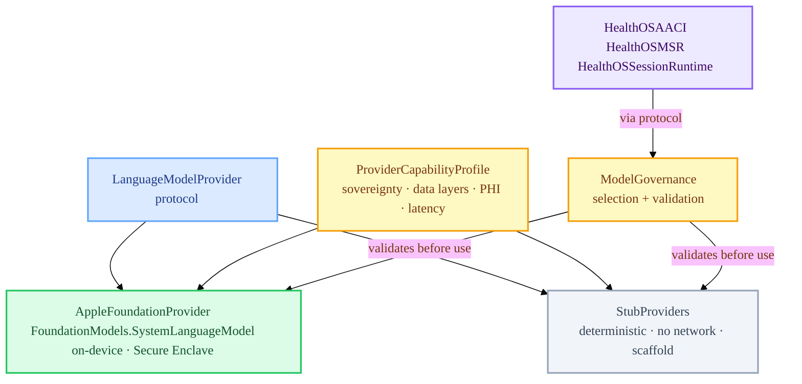

# HealthOSProviders

Provider protocol contracts, Apple FoundationModels adapter, and stub providers for HealthOS.

`HealthOSProviders` is the Tier 2 Swift runtime provider-adapter module. It defines the sovereignty-aware provider boundary for runtime imports. All inference capability in HealthOS flows through the `LanguageModelProvider` protocol and the `ProviderCapabilityProfile` contract, which classifies each provider's sovereignty posture, allowed data layers, PHI access, and latency class. The module also implements the `AppleFoundationProvider` — the primary provider adapter wrapping Apple's on-device `FoundationModels` framework.

`HealthOS/Support/` is separate: it contains governed provider-support tooling, ops, Python, and Create ML/Core ML/MLX scaffolds. Support may help provider work, but it is not imported as `HealthOSProviders` and does not become runtime authority.

**Apple-first is a permanent architectural choice, not a deployment preference.** See `HealthOS/Shared/docs/architecture/46-apple-sovereignty-architecture.md`.

## File Map

| File | Purpose |
| :--- | :--- |
| `ProviderProtocols.swift` | `LanguageModelProvider` protocol, `ProviderCapabilityProfile`, `ProviderKind`, `LatencyClass` |
| `ModelGovernance.swift` | Governance enforcement for provider selection and capability validation |
| `AppleFoundationModelsAdapter.swift` | `AppleFoundationProvider` — wraps `FoundationModels.SystemLanguageModel.default` |
| `StubProviders.swift` | Deterministic stub providers for testing and scaffold posture |

## Provider Architecture



## AppleFoundationProvider

The primary provider wraps `FoundationModels.SystemLanguageModel.default` — Apple's on-device language model available on macOS 26+, iOS 26+, and visionOS 26+.

```swift
public struct AppleFoundationProvider: LanguageModelProvider {
    public let providerName = "apple-foundation"
    public let capabilityProfile: ProviderCapabilityProfile
    // providerId: "apple-foundation"
    // providerKind: .appleNative
    // allowsPHI: true
    // allowsIdentifiableData: false  ← pseudonymized inputs only
    // requiresNetwork: false          ← fully local
    // latencyClass: .interactive
    // supportsProvenanceReporting: true
}
```

Key properties:
- **No network required** — inference runs entirely on-device using Apple Silicon Neural Engine
- **PHI permitted** — subject to pseudonymization at the boundary; raw direct identifiers must never be passed
- **Locale-gated** — validates `SystemLanguageModel.default.supportsLocale(.current)` before use
- **Availability-gated** — `#available(macOS 26.0, iOS 26.0, visionOS 26.0, *)` + `model.availability == .available`
- **isStub fallback** — when `FoundationModels` is not compiled in, the provider transparently degrades to stub posture

## ProviderCapabilityProfile

Every provider must declare a `ProviderCapabilityProfile` to be used within HealthOS. The governance layer enforces sovereignty constraints before any inference call.

| Field | Apple Native | Non-Apple (requires explicit policy) |
| :--- | :--- | :--- |
| `providerKind` | `.appleNative` | `.externalCloud` or `.thirdParty` |
| `requiresNetwork` | `false` | `true` |
| `allowsPHI` | `true` | Explicit policy required |
| `allowsIdentifiableData` | `false` | Explicit policy required |
| `supportsProvenanceReporting` | `true` | Required for HealthOS use |

Non-Apple remote inference providers are not excluded by HealthOS architecture but require explicit policy, degraded-sovereignty classification, provenance markers, and anti-fake constraints per Inv 17/22 (`HealthOS/Shared/docs/execution/10-invariant-matrix.md`).

## Stub Posture

`StubProviders` provides deterministic, no-network stub implementations for:
- All unit and integration tests
- CI environments without `FoundationModels` availability
- Scaffold-phase operations where real inference is not required

Stub providers never claim production capability, never hit external endpoints, and always produce deterministic outputs for test assertions.

## Current Maturity

| Aspect | Status |
| :--- | :--- |
| `LanguageModelProvider` protocol | ✅ Defined |
| `ProviderCapabilityProfile` | ✅ Defined and enforced |
| `AppleFoundationProvider` | ✅ Implemented (availability-gated) |
| `StubProviders` | ✅ Implemented |
| `ModelGovernance` | ✅ Scaffold seam |
| Apple Private Cloud Compute | 🎯 Target architecture — not yet integrated |
| Non-Apple provider policy | 📋 Contract-first — explicit policy required before any integration |
