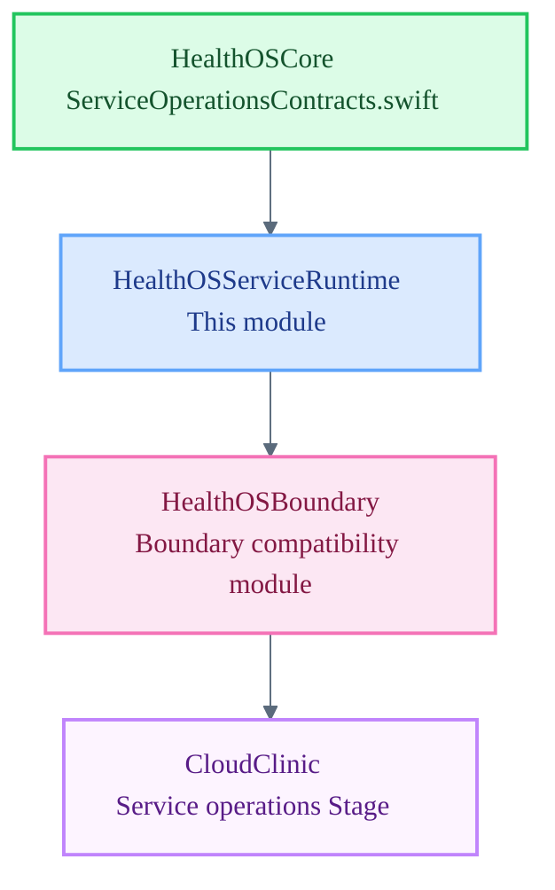

# HealthOSServiceRuntime

Service Runtime — professional and service-operations session lifecycle for HealthOS.

`HealthOSServiceRuntime` is a Tier 2 module subordinate to `HealthOSCore`. It owns the professional/service-operations session surface: service-side session initialization, professional boundary enforcement, habilitation validation, and service-operations state management. It is not constitutional authority and does not hold Core law — it executes service-operations within the boundaries Core defines.

## Architecture Position

## Responsibilities

- Manage service-operations session lifecycle: initialization, active, and closed states
- Enforce professional boundary contracts: habilitation check before any session act
- Produce audit trail entries for every service-operations session transition
- Surface service-side degraded states when upstream runtimes or habilitation checks are unavailable
- Mediate service identity — `Servico` entity wiring, role resolution, and boundary scoping

## File Map

| File | Domain |
| :--- | :--- |
| `ServiceRuntime.swift` | Placeholder enum — service-operations session surface and professional boundary pending implementation |

## Current Maturity

**Scaffold stub.** `ServiceRuntime.swift` declares the module namespace only. The service-operations session surface, habilitation enforcement path, and audit trail are not yet implemented.

`CloudClinic` (technical executable for the service operations Stage) is the primary Stage consumer of this runtime via `HealthOSBoundary`. CloudClinic Stage wiring to this surface is blocked until the mediated session surface is implemented and stable.

Type vocabulary cross-reference: `HealthOSCore/ServiceOperationsContracts.swift`

## Key Invariants

- This module does not hold constitutional authority. Core law governs all invariants.
- Habilitation must be validated before any service-operations session act; fail-closed if habilitation is absent.
- Service identity must never expose raw direct identifiers in any app-facing surface.
- Every session transition must produce a provenance record.
- Professional boundary enforcement is permanent — it must not be relaxed for scaffold convenience.
