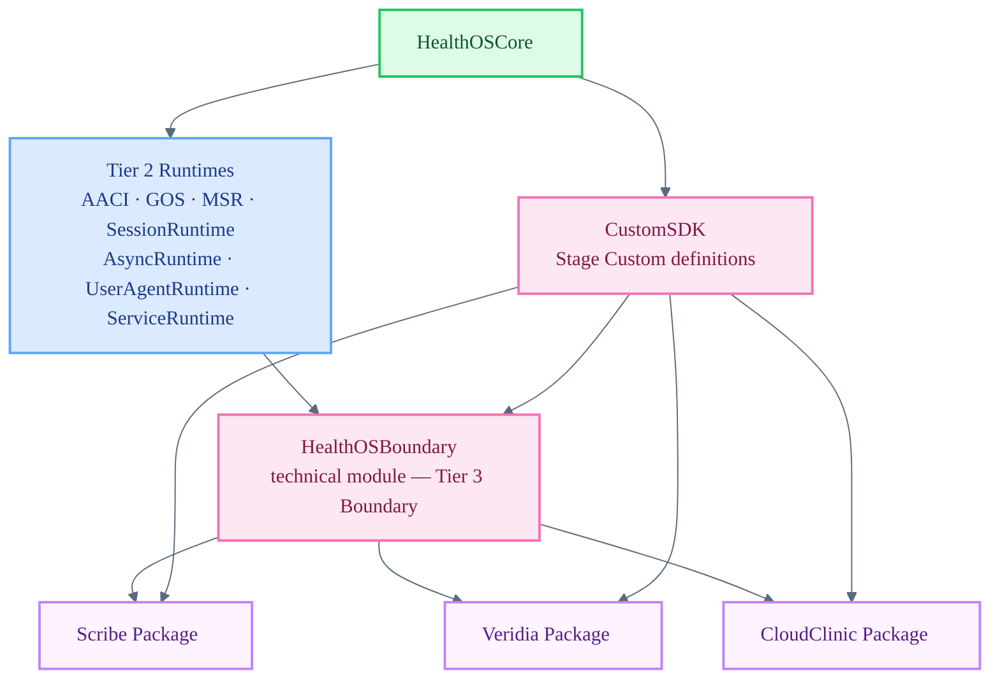

# HealthOSBoundary

Boundary module — the intended import surface for separate Stage packages as this tier matures.

`HealthOSBoundary` is the canonical SwiftPM module for **Boundary**. It is the Tier 3 gateway between Core/GOS/Runtimes and Stage implementations. No Stage package should import `HealthOSCore`, `HealthOSAACI`, `HealthOSSessionRuntime`, or any other Tier 1–2 module directly. Stage packages may depend on the platform package only through `HealthOSBoundary` and `CustomSDK`. All Stage-facing surfaces — session facades, mediated state, safe refs, command/result envelopes, and degraded-state views — are exposed through this module as the facade matures.

## Architecture Position

## Responsibilities

- Expose app-safe session surfaces — facades that wrap `HealthOSSessionRuntime` without leaking internal types
- Provide mediated state views, safe object references, command envelopes, and result envelopes
- Surface degraded-state representations so Stages can render gracefully when Tier 2 runtimes are unavailable
- Enforce the Boundary contract: no raw direct identifiers, no GOS spec JSON, no provider secrets, no storage paths reach Stage code
- Remain the single dependency point; adding a new Tier 2 surface to Stages always goes through this module first
- Pair with `CustomSDK`, which defines the Core-law-governed SDK vocabulary each Stage must satisfy before launch

## File Map

| File | Domain |
| :--- | :--- |
| `Boundary.swift` | Boundary namespace plus transitional re-export shim while mediated facades are completed |

## Current Maturity

**Transitional facade shim.** `Boundary.swift` imports upstream Tier 2 modules and re-exports selected platform modules so the separated Stage packages can compile while the final mediated facades are implemented. The package boundary is now correct: `Scribe`, `Veridia`, and `CloudClinic` are separate Swift packages and do not declare direct dependencies on Core or Tier 2 modules.

The remaining gap is semantic, not package-topological: replace transitional re-exports with explicit app-safe facades, envelopes, safe refs, mediated state, degraded state, and command/result types.

Architecture reference: `HealthOS/Shared/docs/execution/21-structural-ontology-and-product-readiness-plan.md`

## Key Invariants

- Stage packages must import `HealthOSBoundary` and `CustomSDK`; they must never import any Tier 1–2 module directly.
- Raw direct identifiers (CPF, name, DOB in unmasked form) must never appear in any type exported by this module.
- Degraded-state views must be accurate; they must not claim availability that Tier 2 has not confirmed.
- Facade implementations must not bypass Core law checks (consent, habilitation, gate, finality, provenance).
- Stage wiring advances only after the mediated surface it consumes is implemented and stable at Tier 2 and the relevant Custom is complete.
