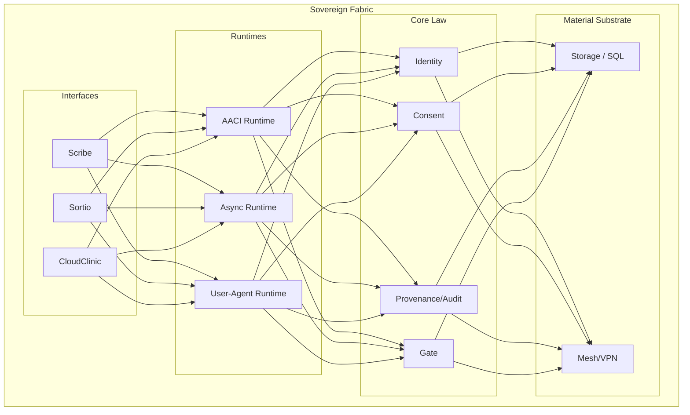
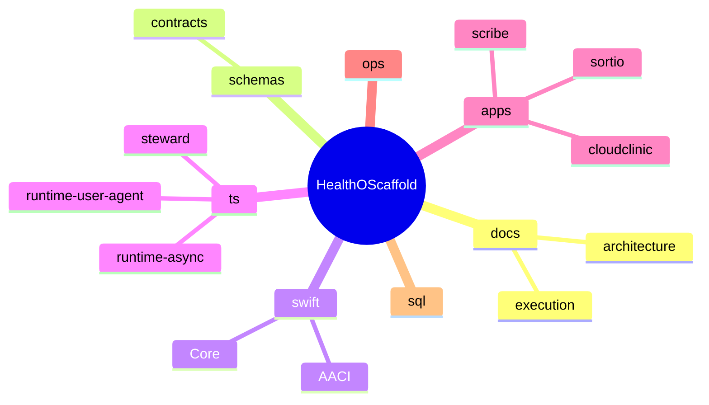

# HealthOScaffold

HealthOS is a sovereign computational environment for health data and clinical operations. This repository is in **controlled implementation / scaffold hardening** phase, establishing foundational architecture.

## 🏗️ Canonical Architecture

HealthOS mediates all clinical acts through a strictly layered, governance-first fabric.



## 📊 Current Maturity Dashboard

| Layer | Status | Focus |
| :--- | :--- | :--- |
| **Core Law** | ✅ Implemented Seam | Invariant-based governance |
| **GOS Layer** | ✅ Operational Path | Stabilization & Binding |
| **AACI First Slice** | 🚧 Scaffold Hardening | Boundary enforcement |
| **Provider/ML** | ⚠️ Stub/Contract | Deterministic safety |
| **Apps/UI** | 🧩 Contract-First | Minimal validation surface |

## 🚀 Quick Start

| Intent | Commands |
| :--- | :--- |
| **Bootstrap** | `make bootstrap` |
| **Build** | `make swift-build`, `make ts-build` |
| **Test** | `make swift-test`, `make ts-test` |
| **Validate** | `make validate-all` |
| **Smoke** | `make smoke-cli`, `make smoke-scribe` |

## 🧠 Developer Protocol (Read in Order)

1. `README.md`
2. `docs/execution/README.md`
3. `docs/execution/00-master-plan.md`
4. `docs/execution/02-status-and-tracking.md`
5. `docs/execution/11-current-maturity-map.md`
6. `docs/execution/skills/*.md`

## 🤖 Project Steward Agent

`@healthos/steward` automates repository diagnostics and planning.

```bash
cd ts && npx --yes --workspace @healthos/steward healthos-steward next-task
```

*Note: Canonical truth resides in `docs/` and project manifests. Steward memory is derived operational state.*

## 📂 Repository Structure


