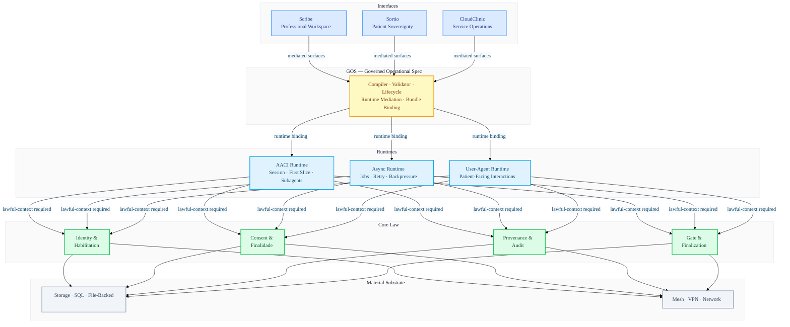
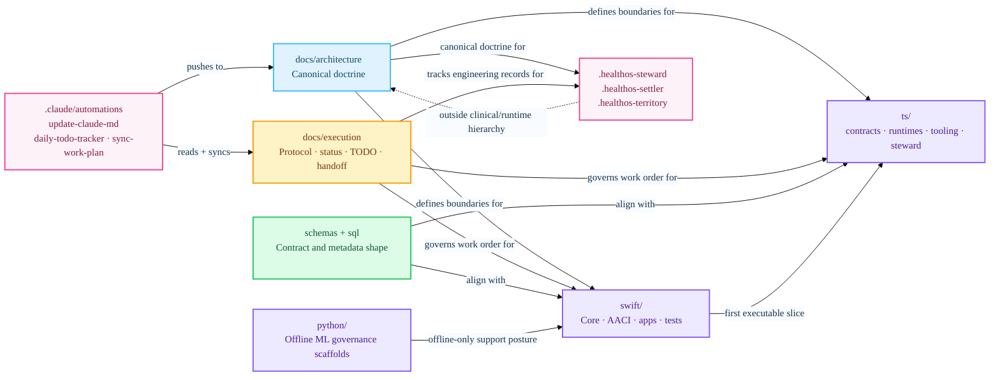
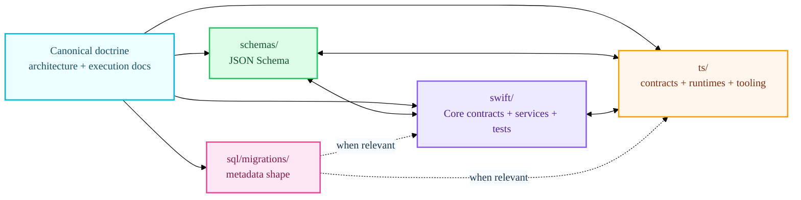

# HealthOS

HealthOScaffold is the historical repository name and initial scaffolding phase for HealthOS. All implemented architecture, contracts, runtimes, apps, tests, and documentation in this repository are part of HealthOS unless explicitly marked experimental or deprecated. "Scaffold" describes maturity, not project identity.

HealthOS is a sovereign computational environment for health data and clinical operations. This repository is the HealthOS construction repository in **controlled implementation / scaffold hardening** phase, establishing foundational architecture.

HealthOS is the full platform. **AACI is one runtime inside HealthOS**. **GOS is a governed operational layer subordinate to Core law**. **Scribe, Sortio, and CloudClinic are app/interfaces that consume mediated surfaces; they never define constitutional law**.

## 🏗️ Canonical Architecture

HealthOS mediates all clinical acts through a strictly layered, governance-first fabric.

Steward, Settlers, Settlements, Territories, and `healthos-mcp` are repository engineering concepts outside this clinical/runtime hierarchy. They can inspect, edit, validate, and record repository work; they do not become HealthOS law, runtime automation, or clinical effectuation.



### First Slice — Executable Orchestration Path

The current scaffold-level executable path, consumed by `HealthOSCLI` and `HealthOSScribeApp`.

```mermaid
%%{init: {'theme': 'base', 'themeVariables': {'primaryColor': '#f0f9ff', 'primaryBorderColor': '#bae6fd', 'primaryTextColor': '#0c4a6e', 'edgeLabelBackground': '#fafafa', 'fontFamily': 'ui-sans-serif, system-ui, -apple-system'}}}%%
flowchart LR
    classDef govern   fill:#dcfce7,stroke:#22c55e,stroke-width:2px,color:#14532d
    classDef capture  fill:#dbeafe,stroke:#60a5fa,stroke-width:2px,color:#1e3a8a
    classDef gos      fill:#fef9c3,stroke:#f59e0b,stroke-width:2px,color:#78350f
    classDef draft    fill:#ede9fe,stroke:#a78bfa,stroke-width:2px,color:#3b0764
    classDef gate     fill:#fce7f3,stroke:#f472b6,stroke-width:2px,color:#831843
    classDef final    fill:#d1fae5,stroke:#34d399,stroke-width:2px,color:#065f46
    classDef terminal fill:#f1f5f9,stroke:#94a3b8,stroke-width:2px,color:#475569

    HAB[Habilitation\nValidate]:::govern
    CON[Consent\nValidate]:::govern
    SES[Session\nStart]:::capture
    CAP[Capture\nAudio · Text]:::capture
    TRA[Transcription\nready · degraded · unavailable]:::capture
    GOS_ACT[GOS Activation\nBundle · Binding Plan]:::gos
    RET[Retrieval\nContext Package]:::capture
    SOAP[SOAP Draft\nCompose]:::draft
    DER[Referral · Prescription\nDerived Drafts]:::draft
    GR[Gate Request]:::gate
    GV[Gate Resolve\napproved · rejected]:::gate
    FIN[Final SOAP\n+ Provenance]:::final
    STOP([withheld]):::terminal

    HAB --> CON --> SES --> CAP --> TRA --> GOS_ACT --> RET --> SOAP --> DER --> GR --> GV
    GV -->|approved| FIN
    GV -->|rejected| STOP
```



## 📋 Current repository posture (April 2026)

This repository is in **controlled implementation / scaffold hardening**:
- multiple cross-language contracts (Swift/TS/JSON Schema/SQL) are executable
- Swift governance and boundary suites are present and runnable
- TypeScript workspace builds; GOS tooling has automated tests
- first-slice execution exists (CLI + minimal Scribe validation surface)

These are HealthOS components at varied maturity levels. Scaffold-stage components are not a separate product and are not placeholders for another future repository; their maturity must simply be described honestly.

It is **not**:
- a production-ready product
- a complete EHR
- a final UI delivery of Scribe/Sortio/CloudClinic
- a real regulatory-signature/interoperability integration
- a real semantic retrieval stack with embeddings/vector index
- a real external provider deployment (LM/STT/embedding remain scaffold/stub posture)

## 📊 Current Maturity Dashboard

| Layer | Status | Focus |
| :--- | :--- | :--- |
| **Core Law** | ✅ Implemented Seam | Invariant-based governance |
| **GOS Layer** | ✅ Operational Path | Stabilization & Binding |
| **AACI First Slice** | 🚧 Scaffold Hardening | Boundary enforcement + GOS-mediated derived drafts |
| **Provider/ML** | ⚠️ Stub/Contract | Deterministic safety |
| **Apps/UI** | 🧩 Contract-First | Minimal validation surface |

## ✨ Reading Paths

Use the README as the entry surface, then branch by intent.

| If you want to... | Start here | Then go to |
| :--- | :--- | :--- |
| understand what HealthOS is | `docs/architecture/01-overview.md` | `docs/architecture/19-interface-doctrine.md`, `docs/architecture/46-apple-sovereignty-architecture.md` |
| understand the executable slice | `docs/architecture/28-first-slice-executable-path.md` | `swift/Sources/HealthOSFirstSliceSupport/FirstSliceRunner.swift`, `swift/Sources/HealthOSCore/FirstSliceContracts.swift` |
| understand GOS | `docs/architecture/29-governed-operational-spec.md` | `30-gos-authoring-and-compiler.md`, `31-gos-runtime-binding.md`, `32-gos-bundles-and-lifecycle.md`, `33-gos-app-consumption-patterns.md` |
| understand apps and boundaries | `docs/architecture/11-scribe.md` | `12-sortio.md`, `13-cloudclinic.md`, `23-scribe-screen-contracts.md`, `24-sortio-screen-contracts.md`, `25-cloudclinic-screen-contracts.md`, `43-cross-app-coordination-shared-surfaces.md` |
| understand current maturity and gaps | `docs/execution/11-current-maturity-map.md` | `13-scaffold-release-candidate-criteria.md`, `14-final-gap-register.md` |
| start coding safely | `docs/execution/README.md` | `01-agent-operating-protocol.md`, `02-status-and-tracking.md`, relevant `todo/*.md`, relevant `skills/*.md` |
| understand Steward for Xcode | `docs/architecture/45-healthos-xcode-agent.md` | `docs/execution/17-healthos-xcode-agent-migration-plan.md`, `.healthos-steward/README.md`, `ts/packages/healthos-steward/README.md` |
| understand Steward, Settlers, Settlements, and Territories | `docs/architecture/47-steward-settler-engineering-model.md` | `docs/execution/19-settler-model-task-tracker.md`, `.healthos-settler/README.md`, `.healthos-territory/README.md` |
| see what documentation tasks remain open | `docs/execution/20-documental-todos-work-plan.md` | `docs/execution/prompts/` (phase execution prompts) |
| see the latest daily status digest | `.healthos-steward/memory/automations/daily-todo-tracker/latest.md` | `docs/execution/02-status-and-tracking.md`, `docs/execution/12-next-agent-handoff.md` |

### Visual Reading Map

Liquid Glass guidance from Apple emphasizes hierarchy, grouping, and restrained use of visual emphasis. This README follows that spirit with grouped diagrams and reading paths rather than trying to mimic UI effects in plain markdown.

```mermaid
%%{init: {'theme': 'base', 'themeVariables': {'primaryColor': '#eef6ff', 'primaryBorderColor': '#b8d7f5', 'primaryTextColor': '#11324d', 'clusterBkg': '#fbfdff', 'clusterBorder': '#d7e7f5', 'titleColor': '#0f172a', 'edgeLabelBackground': '#f8fbff', 'fontFamily': 'ui-rounded, -apple-system, BlinkMacSystemFont, sans-serif'}}}%%
flowchart TD
    classDef entry fill:#e8f3ff,stroke:#7db7e8,stroke-width:2px,color:#12324a
    classDef arch fill:#ecfdf5,stroke:#6fcf97,stroke-width:2px,color:#14532d
    classDef exec fill:#fff7ed,stroke:#f59e0b,stroke-width:2px,color:#7c2d12
    classDef code fill:#f5f3ff,stroke:#a78bfa,stroke-width:2px,color:#4c1d95
    classDef steward fill:#fdf2f8,stroke:#ec4899,stroke-width:2px,color:#831843

    R[README.md\nEntry Surface]:::entry

    A1[Architecture\n01 overview · 19 doctrine · 46 sovereignty]:::arch
    A2[Execution\nREADME · protocol · status · maturity · gaps]:::exec
    A3[Code Surfaces\nswift · ts · schemas · sql]:::code
    A4[Repository Engineering\nSteward · Settlers · Territories]:::steward

    A5[Claude Code Automations\nupdate · digest · sync]:::steward

    R --> A1
    R --> A2
    R --> A3
    R --> A4
    R --> A5

    A1 --> A11[Core law]
    A1 --> A12[GOS]
    A1 --> A13[Apps and interfaces]
    A2 --> A21[What is ready now]
    A2 --> A22[What is blocked]
    A2 --> A23[What to do next]
    A3 --> A31[Executable first slice]
    A3 --> A32[Cross-language contracts]
    A4 --> A41[Steward baseline]
    A4 --> A42[Settler doctrine]
    A4 --> A43[Territory records]
    A5 --> A51[update-claude-md]
    A5 --> A52[daily-todo-tracker]
    A5 --> A53[sync-work-plan]
```



## 🗺️ Repository Atlas

The repository is easier to understand if you read it as four synchronized surfaces: doctrine, execution discipline, executable code, and cross-language contracts.



## 🔎 What To Read Next

### If you are new to HealthOS

1. Read `docs/architecture/01-overview.md`.
2. Read `docs/architecture/19-interface-doctrine.md`.
3. Read `docs/architecture/46-apple-sovereignty-architecture.md`.
4. Return here and then continue into the execution docs.

### If you want the runnable system first

1. Read `docs/architecture/28-first-slice-executable-path.md`.
2. Open `swift/Sources/HealthOSFirstSliceSupport/FirstSliceRunner.swift`.
3. Run `make smoke-cli` and `make smoke-scribe`.
4. Then inspect `docs/execution/10-invariant-matrix.md` to understand what the slice is protecting.

### If you want governance first

1. Read `docs/execution/10-invariant-matrix.md`.
2. Read `docs/execution/06-scaffold-coverage-matrix.md`.
3. Read `docs/execution/11-current-maturity-map.md`.
4. Read `docs/execution/14-final-gap-register.md`.

## 🚀 Quick Start

```bash
make bootstrap
make swift-build
make swift-test
make ts-build
make ts-test
make python-check
make validate-docs
make validate-schemas
make validate-contracts
make validate-all
```

Xcode entrypoint:

- open `HealthOS.xcworkspace` from repository root
- the workspace resolves the canonical Swift package at `swift/Package.swift`

Optional local smoke path:

```bash
make smoke-cli
make smoke-scribe
```

## 🧩 Cross-Language Contract Discipline

HealthOS is intentionally not “just a Swift app” or “just a TypeScript workspace”. The same doctrine is carried through schemas, Swift, TypeScript, SQL shape, and execution docs.



## 🧠 Where agents should start

Read in order before coding:
1. `README.md`
2. `docs/execution/README.md`
3. `docs/execution/00-master-plan.md`
4. `docs/execution/01-agent-operating-protocol.md`
5. `docs/execution/02-status-and-tracking.md`
6. `docs/execution/06-scaffold-coverage-matrix.md`
7. `docs/execution/10-invariant-matrix.md`
8. `docs/execution/11-current-maturity-map.md`
9. `docs/execution/12-next-agent-handoff.md`
10. `docs/execution/13-scaffold-release-candidate-criteria.md`
11. `docs/execution/14-final-gap-register.md`
12. `docs/execution/15-scaffold-finalization-plan.md`
13. `docs/execution/16-next-10-actions-plan.md`
14. relevant `docs/execution/todo/*.md`
15. matching `docs/execution/skills/*.md`

## 📂 Repository map (real, current)

- `docs/architecture/` — canonical architecture/doctrine docs (including GOS, app-boundary, regulatory, and cross-app waves)
- `docs/execution/` — governed execution protocol, status tracking, coverage, invariants, TODOs, maturity/handoff
- `schemas/` — JSON Schema contracts/entities and GOS schemas
- `swift/` — Core, AACI, Providers, first-slice support, CLI, minimal Scribe app, XCTest suites
- `ts/` — workspace packages (`contracts`, `runtime-async`, `runtime-user-agent`, `mcp-local`, `healthos-gos-tooling`)
- `python/` — offline ML governance scaffolds only
- `sql/migrations/001_init.sql` — canonical metadata schema scaffold
- `ops/` and `scripts/` — local operational scaffolding, bootstrap, network and backup notes
- `apps/` — interface boundary scaffolds/documentation
- `.healthos-steward/` — derived Steward state, policies, prompts, and session memory
- `.healthos-steward/memory/automations/` — automation run logs and daily TODO digests (committed to remote after each run)
- `.healthos-settler/` — documentation-only Settler profile and Settlement record scaffolds
- `.healthos-territory/` — documentation-only Territory record scaffolds
- `.claude/automations/` — Claude Code automation definitions (schedule, prompt, git pattern)
- `.claude/scheduled_tasks.json` — durable cron job registry

### Code-to-doc orientation

| Surface | Primary docs | Primary code |
| :--- | :--- | :--- |
| Core law | `docs/architecture/06-core-services.md`, `05-data-layers.md`, `07-storage-and-sql.md` | `swift/Sources/HealthOSCore/` |
| AACI and first slice | `docs/architecture/09-aaci.md`, `28-first-slice-executable-path.md` | `swift/Sources/HealthOSAACI/`, `swift/Sources/HealthOSFirstSliceSupport/` |
| GOS | `29-governed-operational-spec.md` to `34-gos-review-and-activation-policy.md` | `ts/packages/healthos-gos-tooling/`, `swift/Sources/HealthOSCore/` |
| Apps/interfaces | `11-scribe.md`, `12-sortio.md`, `13-cloudclinic.md`, `43-cross-app-coordination-shared-surfaces.md` | `swift/Sources/HealthOSScribeApp/`, app boundary contracts in `swift/Sources/HealthOSCore/` |
| Steward / Settlers / Territories | `45-healthos-xcode-agent.md`, `46-apple-sovereignty-architecture.md`, `47-steward-settler-engineering-model.md` | `ts/packages/healthos-steward/`, `.healthos-steward/`, `.healthos-settler/`, `.healthos-territory/` |

## Steward, Settlers, and Territories

Steward is the canonical engineering agent for this repository. `healthos-steward` is the CLI, package, and repository-local state root.

- CLI and package: `ts/packages/healthos-steward/`
- Repository-local derived state root: `.healthos-steward/`
- Current persisted runtime state: `.healthos-steward/memory/sessions/`

Settlers are specialized engineering agent profiles. Settlements are bounded engineering work units. Territories are documented repository domains. The canonical model is `docs/architecture/47-steward-settler-engineering-model.md`.

- Settler documentation root: `.healthos-settler/`
- Territory documentation root: `.healthos-territory/`
- Current maturity: documentation scaffold only; no executable Settlers, Settlement schema, Territory loader, or `healthos-mcp` server is implemented.

**Steward for Xcode** is the Xcode-integration posture. Steward for Xcode integrates with Xcode Intelligence as an Apple-controlled engineering runtime surface, while HealthOS contributes instructions, `healthos-mcp`, derived repository memory, and deterministic CLI operations. See `docs/architecture/45-healthos-xcode-agent.md` for target architecture and `docs/execution/17-healthos-xcode-agent-migration-plan.md` for the migration plan.

Codex may support Steward-scoped Xcode-facing repository maintenance as an external executor. That role reviews and proposes PRs for Claude Code automations, scheduled-task definitions, Xcode/Steward instructions, and automation drift. It does not create a new Steward category, does not grant merge authority, and remains outside the HealthOS clinical/runtime hierarchy.

Current deterministic baseline (hard-reset posture — only these CLI commands are implemented today):

`dist/` is not committed. Run `make ts-build` once before invoking the CLI:

```bash
make ts-build
cd ts && npx --yes --workspace @healthos/steward healthos-steward status
cd ts && npx --yes --workspace @healthos/steward healthos-steward runtime --message "inspect repository posture" --dry-run
# session requires an existing session id: --id <uuid>
cd ts && npx --yes --workspace @healthos/steward healthos-steward session --id <session-id>
```

Current baseline semantics:
- `status` reports package identity, required docs, and the session store location.
- `runtime` records a minimal request/response turn and persists session state under `.healthos-steward/memory/sessions/`.
- `session` reads one persisted session by id; exits non-zero if `--id` is omitted or no matching session exists.

Target future operations such as `scan-status`, `get-handoff`, `next-task`, `validate-docs`, and `validate-all` belong to the planned deterministic CLI and/or `healthos-mcp` workstreams. They must not be described as delivered until implemented.

`healthos-mcp` is the repository-maintenance MCP server for Steward (doctrine-only; not yet implemented). It is distinct from any future Core-governed runtime MCP servers for clinical or operational automation.

Canonical truth resides in `docs/` and project manifests. Steward memory, Settler scaffolds, Settlement records, and Territory records are derived or instructional engineering surfaces. They are non-clinical, non-constitutional, and non-authorizing.


## 🤖 Claude Code Automations

Three durable Claude Code automations keep the repository state synchronized and documented. All follow the same **main-first** pattern: pull `origin/main` before reading, write output, then commit and push back to `origin/main`. This means any agent — local or remote — always sees the latest state after a pull.

Codex maintains a companion local automation for Steward-scoped Xcode-facing maintenance: `$CODEX_HOME/automations/steward-xcode-facing-maintenance/`. It is a review/PR surface for automation definitions and instruction drift, not a replacement for the Claude Code scheduled jobs.

| Automation | Schedule | What it does | Output pushed to main |
| :--- | :--- | :--- | :--- |
| `update-claude-md` | Mon 09:03 | Reviews recent git history, Makefile, and Steward CLI; updates CLAUDE.md with genuinely new commands or patterns | `CLAUDE.md` + memory log |
| `daily-todo-tracker` | Daily 08:07 | Scans all `todo/*.md`, trackers, and gap register; writes a structured daily status digest | `.healthos-steward/memory/automations/daily-todo-tracker/YYYY-MM-DD.md` + `latest.md` |
| `sync-work-plan` | Mon/Wed/Fri 08:47 | Builds a truth table for every open documental task; marks completed, unblocks dependencies, surfaces new gaps | `docs/execution/20-documental-todos-work-plan.md` + memory log |

Automation definitions: `.claude/automations/` · Cron registry: `.claude/scheduled_tasks.json`

To run any automation immediately: ask Claude Code directly (e.g. *"rode o daily-todo-tracker agora"*).

```mermaid
%%{init: {'theme': 'base', 'themeVariables': {'primaryColor': '#f0fdf4', 'primaryBorderColor': '#86efac', 'primaryTextColor': '#14532d', 'clusterBkg': '#fafafa', 'clusterBorder': '#e2e8f0', 'titleColor': '#0f172a', 'edgeLabelBackground': '#f8fafc', 'fontFamily': 'ui-sans-serif, system-ui, -apple-system'}}}%%
flowchart LR
    classDef trigger  fill:#f0fdf4,stroke:#22c55e,stroke-width:2px,color:#14532d
    classDef git      fill:#dbeafe,stroke:#3b82f6,stroke-width:2px,color:#1e3a8a
    classDef read     fill:#fef9c3,stroke:#f59e0b,stroke-width:2px,color:#78350f
    classDef write    fill:#ede9fe,stroke:#8b5cf6,stroke-width:2px,color:#4c1d95
    classDef mem      fill:#fce7f3,stroke:#ec4899,stroke-width:2px,color:#831843

    CRON[Cron trigger\nor manual request]:::trigger
    STASH[stash + checkout main\ngit pull origin main]:::git
    READ[read sources\ndocs · todo · trackers · gaps · git log]:::read
    WRITE[write output\ndoc update or digest]:::write
    COMMIT[git add + commit\ngit push origin main]:::git
    RESTORE[restore branch\ngit stash pop]:::git
    MEM[.healthos-steward/memory/\nautomations/]:::mem

    CRON --> STASH --> READ --> WRITE --> COMMIT --> RESTORE
    WRITE --> MEM
    MEM --> COMMIT
```



### Documental work plan

`docs/execution/20-documental-todos-work-plan.md` is the living plan for all open documentation tasks (9 tasks across 3 phases). It is kept synchronized by the `sync-work-plan` automation.

Phase execution prompts (self-contained, ready for any AI agent) live in `docs/execution/prompts/`:

| Prompt file | Phase | Tasks |
| :--- | :--- | :--- |
| `phase-1-settler-territory.md` | Phase 1 | ST-006 Territory records · ST-002 Settler profiles · ST-003 Settlement schema |
| `phase-2-architecture-proposals.md` | Phase 2 | CL-006 Error envelope · OPS-003 Incident command set · ST-004 healthos-mcp spec |
| `phase-3-xcode-agent-streams.md` | Phase 3 | Stream C tool contracts · Stream D backend contract · Stream F Xcode envelope |

## Canonical hierarchy

```text
Material substrate
  └─ host, storage, private network/mesh, backups
HealthOS Core
  └─ law/governance (identity, consent, habilitation, storage, provenance, gate, audit)
Governed Operational Spec (GOS)
  └─ operational translation layer subordinate to Core
HealthOS Runtimes
  ├─ AACI runtime
  ├─ Async runtime
  └─ User-Agent runtime
Actors / Agents
  └─ bounded actors and role-governed agents
Apps / Interfaces
  ├─ Scribe (professional workspace)
  ├─ Sortio (patient sovereignty)
  └─ CloudClinic (service operations)
Artifacts / Effects
  └─ drafts, gate records, final artifacts, provenance/audit traces
```

## Maturity snapshot by layer

Use `docs/execution/11-current-maturity-map.md` for full detail. Short view:
- Core law + storage governance: **implemented seam / tested operational path (local scaffold)**
- GOS authoring/compiler/lifecycle: **implemented seam / tested operational path (scaffold hardening)**
- AACI + first slice orchestration: **implemented seam / tested operational path (bounded scope)**

## Scaffold/foundation phase closure references

For final scaffold/foundation phase closure auditing and handoff discipline, use:
- `docs/execution/13-scaffold-release-candidate-criteria.md`
- `docs/execution/14-final-gap-register.md`
- `docs/execution/15-scaffold-finalization-plan.md`
- `docs/execution/16-next-10-actions-plan.md`
