<p align="center">
  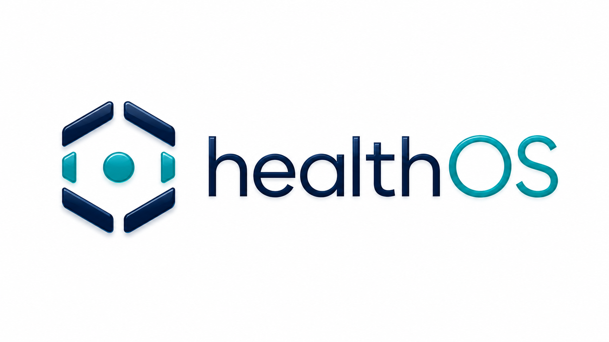
</p>

<p align="center">
  
  
  
  
  
</p>

# HealthOS

> **Sovereign computational environment for health data and clinical operations.**  
> Governance-first architecture — every clinical act mediated through strictly layered contract law.

**HealthOScaffold is the historical repository name for the scaffold/foundation phase of HealthOS.** All implemented architecture, contracts, runtimes, apps, tests, and documentation in this repository are HealthOS work. "Scaffold" describes maturity, not product identity.

**This repository is not production-ready, not a complete EHR, and not a final UI delivery.** It establishes foundational architecture with executable first-slice orchestration, cross-language contracts (Swift / TypeScript / JSON Schema / SQL), and macOS 26+ native app surfaces targeting Liquid Glass as the design baseline.

HealthOS is the full platform. **Tier 1 — Mestral Core is constitutional law. Tier 2 — GOS / Runtimes executes and mediates under Core, including the `HealthOSProviders` runtime-adapter module. Tier 3 — Custom Boundary is the HealthOS-owned consumption frontier and the governed Stage-definition boundary. Tier 4 — Stages Cast contains Scribe, Veridia, CloudClinic, and future governed application consumers as a separate Stage universe whose point of contact is Boundary. Constructor / Construction System stays outside the clinical/runtime hierarchy. Support is shared ops, Python, provider-support, and ML tooling, reachable from multiple layers but governed by Core.**

---

## Requirements

| Tool | Version | Purpose |
| :--- | :--- | :--- |
| Swift / SwiftPM | 6.2+ | Platform package (Tiers 1–3), Stage packages, `HealthOSCLI` |
| macOS | 26+ | Required build and runtime platform; Liquid Glass surfaces require macOS 26+ |
| Xcode | 26+ | Open `HealthOS.xcworkspace` for shared schemes, test plans, and Swift previews |
| Node.js | LTS (20+) | TypeScript workspace (`HealthOS/Constructor/ts/`) |
| pnpm | 9+ | Workspace package manager — required for `Constructor/ts` |
| Python | 3.11+ | Support ML and governance scaffolds (`HealthOS/Support/python/`) — optional |

> **External framework dependencies: none.** The Swift platform package is sovereignty-by-design. TypeScript tooling uses no proprietary cloud SDKs. Provider adapters (`HealthOSProviders`, `HealthOS/Support/ML/`) interact only with local Apple on-device models.

---

## How to Read This Repository

Use this README as an entry surface, not as a replacement for the canonical architecture and execution docs. The repository mixes tested operational paths, implemented seams, scaffolded contracts, placeholders, and future gaps; read every claim through that maturity lens.

| Reader question | Current answer | Canonical follow-up |
| :--- | :--- | :--- |
| What is HealthOS? | The whole governed, app-agnostic platform for health operations, not one app or an EHR skin. | `HealthOS/Shared/docs/architecture/01-overview.md` |
| What proves executable behavior today? | The Swift first-slice path through habilitation, consent, capture, retrieval, SOAP draft, gate, final SOAP, and provenance. | `HealthOS/Shared/docs/architecture/28-first-slice-executable-path.md` |
| What is still scaffolded or placeholder? | Provider deployment, semantic retrieval, final app shells, regulatory/signature/interoperability effectuation, and production ops. | `HealthOS/Shared/docs/execution/11-current-maturity-map.md` |
| Where does construction tooling sit? | Steward, Settlers, Settlements, Territories, and `healthos-forge-mcp` are repository engineering surfaces outside the clinical/runtime hierarchy. | `HealthOS/Shared/docs/execution/22-steward-construction-operating-model.md` |

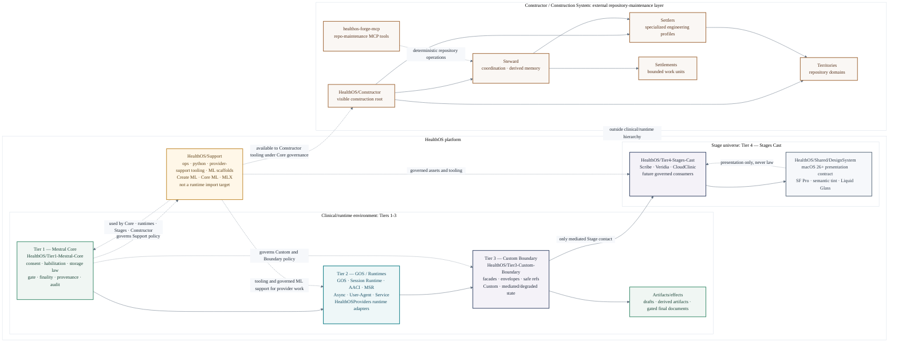

### Evidence and Maturity Lens

| Maturity term | How to read it here | Example surfaces |
| :--- | :--- | :--- |
| `tested operational path` | Executable path plus tests/smoke evidence inside the scaffold boundary. | Core law, GOS lifecycle/tooling, validation harness, first-slice gate behavior |
| `implemented seam` | Real interface or adapter exists, but broader production or multi-runtime coverage is still incomplete. | AACI first-slice mediation, local async runtime, Scribe minimal validation surface, construction system |
| `scaffolded contract` | Types, schemas, docs, or validators define the boundary, but full runtime/UI/provider behavior is not complete. | MSR stage contracts, provider/ML posture, Veridia and CloudClinic app-safe contracts |
| `doctrine-only` / placeholder | Canonical scope or target exists without executable product behavior. | Future HealthOS control panel, production mesh/fabric, final native app shells |
| not claimed | Do not infer this from the scaffold. | production readiness, complete EHR, real regulatory/signature/interoperability integration, real semantic retrieval |

---

## 🏗️ Canonical Architecture

HealthOS is a governance-first platform. Every clinical act flows through a strictly layered, consent- and provenance-governed fabric. Stages consume only mediated surfaces through Boundary — they never become law engines.

The clinical/runtime environment is composed by Tiers 1-3 plus the Stage universe that consumes it. Tier 4 Stages are still HealthOS clinical/application surfaces, but they are intentionally displayed and governed as a separate consumer universe: their contact point is Tier 3 Custom Boundary, not direct Core/GOS/runtime ownership.

Stage work advances only after the mediated surface the Stage consumes is implemented and stable, not merely contracted, and after the relevant Custom is complete. See `HealthOS/Shared/docs/architecture/50-app-layer-boundary-and-reference-apps.md` for the Boundary, Stage, Custom, and task-ordering doctrine.

`HealthOSProviders` remains the Swift runtime provider-adapter target under Tier 2. `HealthOS/Support/` contains shared provider-support tooling, ops, Python, and governed ML scaffolds; it may support Core, runtimes, Stages, and Constructor workflows, but its usage remains governed by Core law and ModelGovernance.

`HealthOS/Constructor/` is the visible Construction System root. Steward, Settlers, Settlements, Territories, and `healthos-forge-mcp` are repository engineering concepts **outside** this clinical/runtime hierarchy. They inspect, edit, validate, and record repository work. They do not become HealthOS law, runtime automation, or clinical effectuation.

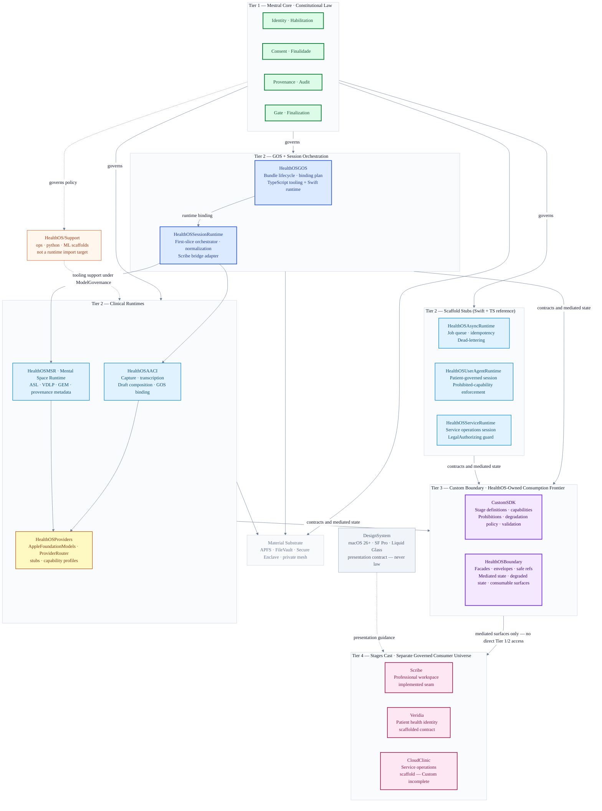

### First Slice — Executable Orchestration Path

The current scaffold-level executable path, consumed by `HealthOSCLI` and `Scribe`:

```mermaid
%%{init: {'theme': 'base', 'themeVariables': {'primaryColor': '#f0f9ff', 'primaryBorderColor': '#bae6fd', 'primaryTextColor': '#0c4a6e', 'edgeLabelBackground': '#fafafa', 'fontFamily': 'ui-sans-serif, system-ui, -apple-system'}}}%%
flowchart LR
    classDef govern   fill:#dcfce7,stroke:#22c55e,stroke-width:2px,color:#14532d
    classDef capture  fill:#dbeafe,stroke:#60a5fa,stroke-width:2px,color:#1e3a8a
    classDef gos      fill:#fef9c3,stroke:#f59e0b,stroke-width:2px,color:#78350f
    classDef norm     fill:#ecfeff,stroke:#06b6d4,stroke-width:2px,color:#164e63
    classDef msr      fill:#ede9fe,stroke:#a78bfa,stroke-width:2px,color:#3b0764
    classDef draft    fill:#fdf4ff,stroke:#c084fc,stroke-width:2px,color:#581c87
    classDef gate     fill:#fce7f3,stroke:#f472b6,stroke-width:2px,color:#831843
    classDef final    fill:#d1fae5,stroke:#34d399,stroke-width:2px,color:#065f46
    classDef terminal fill:#f1f5f9,stroke:#94a3b8,stroke-width:2px,color:#475569

    HAB[Habilitation\nValidate]:::govern
    CON[Consent\nValidate]:::govern
    SES[Session\nStart]:::capture
    GOS_ACT[GOS Activation\nBundle · Binding Plan]:::gos
    CAP[Capture\nAudio · Text]:::capture
    TRA[Transcription\nready · degraded · unavailable]:::capture
    NORM[Transcript\nNormalization]:::norm
    MSR[MSR Pipeline\nASL · VDLP · GEM]:::msr
    RET[Retrieval\nContext Package]:::capture
    SOAP[SOAP Draft\nCompose]:::draft
    DER[Referral · Prescription\nDerived Drafts]:::draft
    GR[Gate Request]:::gate
    GV[Gate Resolve\napproved · rejected]:::gate
    FIN[Final SOAP\n+ Provenance]:::final
    STOP([withheld]):::terminal

    HAB --> CON --> SES --> GOS_ACT --> CAP --> TRA --> NORM
    NORM --> MSR
    NORM --> RET
    MSR --> SOAP
    RET --> SOAP
    SOAP --> DER --> GR --> GV
    GV -->|approved| FIN
    GV -->|rejected| STOP
```

---

## 📦 Swift Package Graph

The public platform Swift products build from `HealthOS/Package.swift` (Swift tools 6.2, platform `.macOS(.v26)`). This central package owns Tiers 1-3, `CustomSDK`, `HealthOSCLI`, and structural test targets for Construction System, Support, Stage package separation, and shared governance suites. Tier 4 Stages are separate Swift packages under `HealthOS/Tier4-Stages-Cast/<Stage>/Package.swift`; they consume the platform only through `HealthOSBoundary` and `CustomSDK`. External dependencies: none — sovereignty by design.

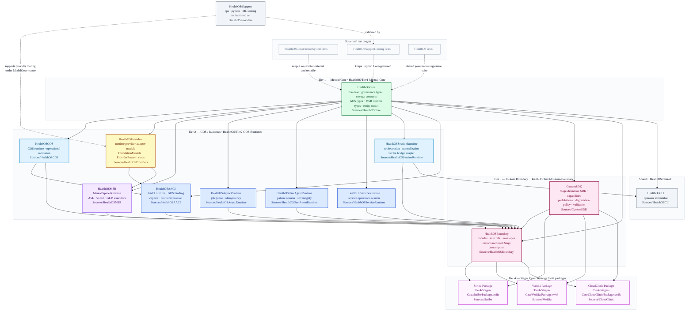

| Target | Tier | Kind | Description |
| :--- | :--- | :--- | :--- |
| `HealthOSCore` | Tier 1 — Mestral Core | Library | Core law, governance types, storage contracts, GOS types, MSR runtime types, entity model |
| `HealthOSProviders` | Tier 2 — GOS / Runtimes | Library | Runtime provider-adapter module: provider protocol contracts, `AppleFoundationProvider` (FoundationModels), stub providers, model governance |
| `HealthOSGOS` | Tier 2 — GOS / Runtimes | Library | GOS runtime — operational mediation subordinate to Core law; canonical home for GOS lifecycle (migration from AACI in progress) |
| `HealthOSAACI` | Tier 2 — GOS / Runtimes | Library | AACI runtime, GOS binding consumption, session capture, draft composition |
| `HealthOSMSR` | Tier 2 — GOS / Runtimes | Library | Mental Space Runtime pipeline — ASL, VDLP, GEM executors, provenance metadata |
| `HealthOSAsyncRuntime` | Tier 2 — GOS / Runtimes | Library | Durable job queue and async task lifecycle — scaffold stub; TS reference implementation in `HealthOS/Constructor/ts/packages/runtime-async/` |
| `HealthOSUserAgentRuntime` | Tier 2 — GOS / Runtimes | Library | Patient/user-side session lifecycle and sovereignty enforcement — scaffold stub |
| `HealthOSServiceRuntime` | Tier 2 — GOS / Runtimes | Library | Professional/service-operations session lifecycle — scaffold stub |
| `HealthOSSessionRuntime` | Tier 2 — GOS / Runtimes | Library | Session orchestration (`SessionRunner`), transcript normalization executor, Scribe bridge adapter |
| `CustomSDK` | Tier 3 — Custom Boundary | Library | Stage-definition SDK: Custom manifests, capabilities, prohibitions, degradation policy, validation requirements, and compliance checks |
| `HealthOSBoundary` | Tier 3 — Custom Boundary | Library | Boundary compatibility module — the technical import surface for mediated Stage consumption; transitional shim pending full Tier 2 facade stabilization |
| `HealthOSCLI` | — | Executable | Operator command-line interface for session and GOS lifecycle |

Tier 4 Stage executables are no longer products of the central platform package:

| Stage package | Product | Required platform imports | Maturity |
| :--- | :--- | :--- | :--- |
| `HealthOS/Tier4-Stages-Cast/Scribe/Package.swift` | `Scribe` | `HealthOSBoundary`, `CustomSDK` | Scribe professional workspace Stage validation surface (SwiftUI, macOS 26+) |
| `HealthOS/Tier4-Stages-Cast/Veridia/Package.swift` | `Veridia` | `HealthOSBoundary`, `CustomSDK` | Veridia patient identity Stage boundary — smoke-testable, no final UI |
| `HealthOS/Tier4-Stages-Cast/CloudClinic/Package.swift` | `CloudClinic` | `HealthOSBoundary`, `CustomSDK` | CloudClinic service operations Stage — scaffold placeholder, no final UI |

---

## 🪟 Native Interface Layer — Liquid Glass Design System

HealthOS native macOS surfaces target macOS 26+ and adopt **Liquid Glass as the design baseline** per `HealthOS/Shared/docs/architecture/48-native-macos-ui-design-system-and-app-shells.md`.

Standard SwiftUI/AppKit controls and navigation surfaces (sidebars, toolbars, sheets, `NavigationSplitView`) inherit system Liquid Glass behavior automatically. Custom `glassEffect`, `GlassEffectContainer`, and glass button styles are reserved for app-specific HealthOS surfaces not covered by standard controls.

**Current scaffold state:** `Scribe` uses `GroupBox` + `.thinMaterial` with standard SwiftUI controls. `HealthOS/Shared/DesignSystem/` is the implemented design system baseline (DS-001, 2026-05-05). Full Liquid Glass adoption is in progress as the macOS 26+ native app shell matures.

<p align="center">
  
</p>

### UI Component Stack

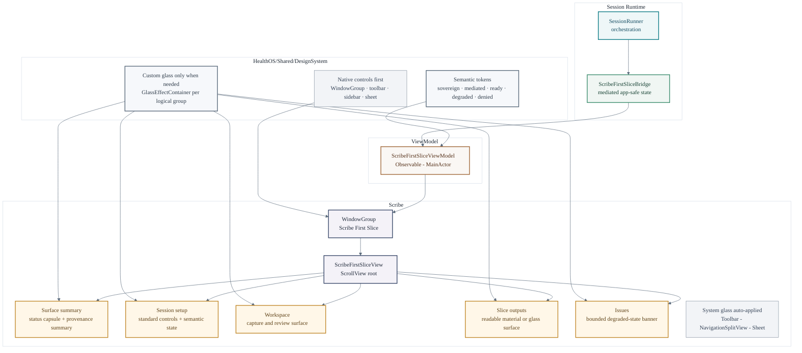

### ScribeFirstSliceView — Session Lifecycle & Glass Surfaces

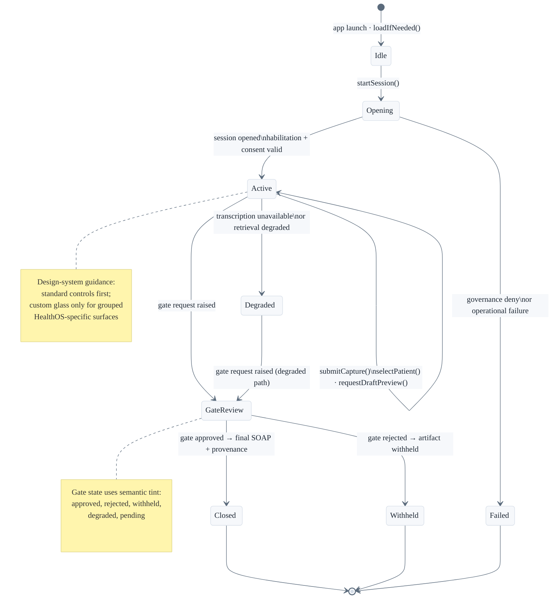

### Liquid Glass Adoption Map (macOS 26+)

| Surface | Current (scaffold) | macOS 26+ target |
| :--- | :--- | :--- |
| App window | `WindowGroup` | `WindowGroup` + system auto-glass toolbar |
| Navigation | flat `VStack` | `NavigationSplitView` with auto-glass sidebar |
| Session cards | `GroupBox` | `GlassEffectContainer` (one per logical group) |
| Output blocks | `.thinMaterial` | `glassEffect` modifier |
| Gate panel | plain `HStack` buttons | Glass-prominent approve/reject with semantic tint |
| Degraded banner | `.secondary` text | Tinted glass warning surface |
| Issues list | `ForEach` + `Text` | Grouped in single `GlassEffectContainer` |

> **Rule:** group nearby custom glass elements in one `GlassEffectContainer`. Standard controls and navigation surfaces never need explicit glass modifiers — they adapt automatically on macOS 26+. Keep tint semantic, not decorative.

---

## 📋 Current Repository Posture (May 2026)

This repository is in **controlled implementation / scaffold hardening**:

| Layer | Status | Focus |
| :--- | :--- | :--- |
| **Core Law** | ✅ Implemented Seam | Invariant-based governance, storage contracts |
| **GOS Layer** | ✅ Operational Path | Stabilization, bundle binding, compiler tooling |
| **AACI First Slice** | 🚧 Scaffold Hardening | Boundary enforcement + GOS-mediated derived drafts |
| **MSR Pipeline** | 🚧 Scaffold | ASL · VDLP · GEM stages, provenance metadata |
| **Provider / ML** | ⚠️ Stub / Contract | `AppleFoundationProvider` adapter; deterministic safety posture |
| **Stage / UI** | 🧩 Contract-First | Minimal Scribe validation surface; Veridia Boundary scaffold; CloudClinic blocked before new wiring |
| **Liquid Glass UI** | 🎯 macOS 26+ Baseline | `HealthOS/Shared/DesignSystem/` baseline (DS-001); glass adoption in progress |
| **Construction System** | ✅ Implemented Seam | 10 CLI commands (healthos-steward) + 10 MCP tools (healthos-forge-mcp) |

Read this table as an onboarding summary. The authoritative maturity ladder is `doctrine-only` → `scaffolded contract` → `implemented seam` → `tested operational path` → `production-hardened`, maintained in `HealthOS/Shared/docs/execution/11-current-maturity-map.md`.

### Known Limitations

The following are **not present in this repository** and must not be inferred from scaffold behavior:

| Area | Limitation |
| :--- | :--- |
| Production readiness | This is a scaffold/foundation phase. Not production-ready in any tier. |
| EHR | Not a complete Electronic Health Record. |
| UI delivery | No final native macOS app shell for any Stage (Scribe, Veridia, CloudClinic). |
| Regulatory / signature | Fail-closed validators exist; no real endpoint, signature provider, or interoperability integration. |
| Semantic retrieval | Governed contracts exist; no real embeddings adapter, vector index, or embedding provider. |
| External providers | `HealthOSProviders` and `HealthOS/Support/ML/` remain scaffold/stub posture for LM, STT, and embedding. |
| Async Runtime | Swift stub; TS reference implementation exists but no PostgreSQL-backed executor. |
| MSR execution | ASL/VDLP/GEM contracts defined; pipeline execution incomplete end-to-end. |
| Production fabric | Network/mesh is doctrine-only; no production sovereign fabric or ACL tooling. |
| CloudClinic wiring | `APP-012` is BLOCKED — Custom definition incomplete; Boundary needs explicit service facade decision. |
| CI/CD | Validation harness is local-only (Make + scripts); no GitHub Actions CI pipeline yet. |

---

## 🚀 Quick Start

```bash
# Bootstrap all surfaces
make bootstrap

# Build
make swift-build
make ts-build
make python-check

# Test
make swift-test
make ts-test

# Validate contracts and documentation
make validate-schemas
make validate-contracts
make validate-docs
make validate-all
```

**Xcode:** open `HealthOS.xcworkspace` from repository root — resolves `HealthOS/Package.swift`, visible `Constructor` / `Support` roots, shared schemes, profile schemes, and layer test plans.

**Smoke paths:**

```bash
make smoke-cli
make smoke-scribe
make smoke-veridia
make smoke-cloudclinic
```

**Direct smoke commands:**

```bash
cd HealthOS && swift run HealthOSCLI
cd HealthOS && swift run HealthOSCLI --reject-gate
cd HealthOS/Tier4-Stages-Cast/Scribe && swift run Scribe --smoke-test
cd HealthOS/Tier4-Stages-Cast/Scribe && swift run Scribe --smoke-test-audio
cd HealthOS/Tier4-Stages-Cast/Veridia && swift run Veridia --smoke-test
cd HealthOS/Tier4-Stages-Cast/CloudClinic && swift run CloudClinic --smoke-test
```

**GOS bundle lifecycle:**

```bash
cd HealthOS && swift run HealthOSCLI \
  --gos-review-bundle <bundle-id> \
  --gos-spec-id <spec-id> \
  --reviewer-id <id> \
  --review-rationale "<reason>"

cd HealthOS && swift run HealthOSCLI \
  --gos-promote-bundle <bundle-id> \
  --gos-spec-id <spec-id> \
  --activator-id <id> \
  --activation-rationale "<reason>"
```

`Veridia` has a smoke-testable Veridia session boundary. `CloudClinic` remains a scaffold placeholder executable for product-graph representation. Neither implements final UI, clinical authority, real provider/signature/interoperability behavior, or production readiness.

### Environment Variables

| Variable | Default | Purpose |
| :--- | :--- | :--- |
| `FORGE_MCP_PORT` | `3791` | Port for `healthos-forge-mcp` Streamable HTTP server |
| `FORGE_MCP_URL` | _(unset)_ | Publicly reachable URL for remote Managed Agent connection; localhost is not sufficient |
| `ANTHROPIC_API_KEY` | _(unset)_ | Required for `healthos-managed-agent` live create/update (ST-022/ST-023) |
| `ANTHROPIC_AUTH_TOKEN` | _(unset)_ | Alternative auth token for Anthropic API (used in place of `ANTHROPIC_API_KEY`) |

> No secrets are committed to this repository. Provider local configs with secrets must never be committed. If you encounter API keys or tokens in the codebase, move them to environment variables or a secret manager immediately.

---

## 🧩 Cross-Language Contract Discipline

HealthOS is not "just a Swift app" or "just a TypeScript workspace". The same doctrine flows through schemas, Swift, TypeScript, SQL, and execution docs. **When ontology or contracts change, align all four surfaces in the same work unit.**

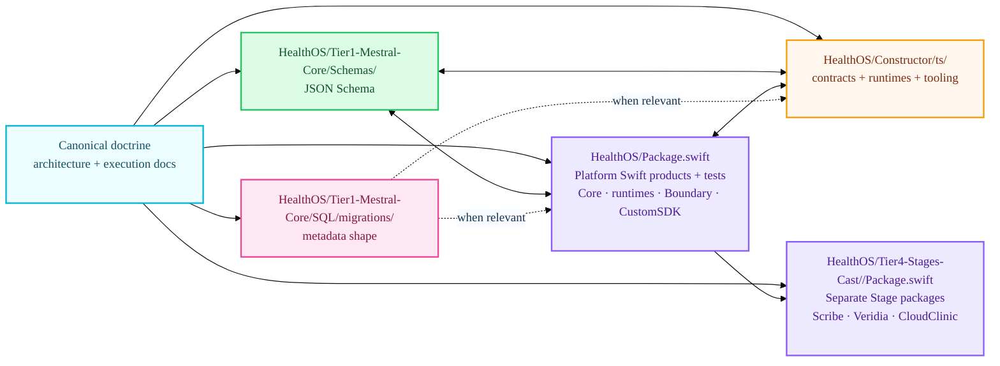

---

## ✨ Reading Paths

| If you want to… | Start here | Then go to |
| :--- | :--- | :--- |
| Understand what HealthOS is | `HealthOS/Shared/docs/architecture/01-overview.md` | `19-interface-doctrine.md`, `46-apple-sovereignty-architecture.md` |
| Understand the consolidated technical product definition | `HealthOS/Shared/docs/product/01-healthos-technical-product-specification.md` | `HealthOS/Shared/docs/product/README.md`, `HealthOS/Shared/docs/architecture/` and `HealthOS/Shared/docs/execution/` sources referenced by the spec |
| Understand the executable slice | `HealthOS/Shared/docs/architecture/28-first-slice-executable-path.md` | `HealthOS/Tier2-GOS-Runtimes/Sources/HealthOSSessionRuntime/SessionRunner.swift`, `HealthOS/Tier1-Mestral-Core/Sources/HealthOSCore/FirstSliceContracts.swift` |
| Understand GOS | `HealthOS/Shared/docs/architecture/29-governed-operational-spec.md` | `30-gos-authoring-and-compiler.md` → `33-gos-app-consumption-patterns.md` |
| Understand MSR | `HealthOS/Shared/docs/architecture/49-mental-space-runtime.md` | `HealthOS/Tier2-GOS-Runtimes/Sources/HealthOSMSR/`, `HealthOS/Tier1-Mestral-Core/Sources/HealthOSCore/MSRRuntime.swift` |
| Understand native UI + Liquid Glass | `HealthOS/Shared/docs/architecture/48-native-macos-ui-design-system-and-app-shells.md` | `HealthOS/Tier4-Stages-Cast/Scribe/Sources/Scribe/` |
| Understand Apple sovereignty | `HealthOS/Shared/docs/architecture/46-apple-sovereignty-architecture.md` | `HealthOS/Tier2-GOS-Runtimes/Sources/HealthOSProviders/AppleFoundationModelsAdapter.swift` |
| Understand apps and boundaries | `HealthOS/Shared/docs/architecture/11-scribe.md` | `12-veridia.md`, `13-cloudclinic.md`, `43-cross-app-coordination-shared-surfaces.md` |
| Understand maturity and gaps | `HealthOS/Shared/docs/execution/11-current-maturity-map.md` | `13-scaffold-release-candidate-criteria.md`, `14-final-gap-register.md` |
| Start coding safely | `HealthOS/Shared/docs/execution/README.md` | `01-agent-operating-protocol.md`, `02-status-and-tracking.md`, relevant `todo/*.md` |
| Understand Steward for Xcode | `HealthOS/Shared/docs/architecture/45-healthos-xcode-agent.md` | `HealthOS/Shared/docs/execution/17-healthos-xcode-agent-migration-plan.md` |
| Understand the construction system | `HealthOS/Shared/docs/execution/22-steward-construction-operating-model.md` | `HealthOS/Shared/docs/execution/19-settler-model-task-tracker.md`, `HealthOS/Constructor/Settler/territories/` |
| Use Steward CLI | `CLAUDE.md` Steward usage section | `HealthOS/Constructor/ts/agent-infra/healthos-steward/` |
| Use healthos-forge-mcp | `HealthOS/Constructor/ts/agent-infra/healthos-forge-mcp/` | `HealthOS/Shared/docs/execution/22-steward-construction-operating-model.md` |
| See open documentation tasks | `HealthOS/Shared/docs/execution/20-documental-todos-work-plan.md` | `HealthOS/Shared/docs/execution/prompts/` |
| Select the next implementation task | `HealthOS/Shared/docs/execution/21-structural-ontology-and-product-readiness-plan.md` — canonical priority-ordered task list | `HealthOS/Shared/docs/execution/02-status-and-tracking.md`, relevant `todo/*.md` |
| See current status and handoff | `HealthOS/Shared/docs/execution/02-status-and-tracking.md` | `HealthOS/Shared/docs/execution/12-next-agent-handoff.md` |

### Executive Visual Overview

`DOC-README-VISUAL-PRESENTATION-001` produced an editable visual overview deck as an external work-unit deliverable because this checkout does not yet contain a clear versioned `HealthOS/Shared/docs/assets/presentations/` pattern. When a repository asset policy exists, the intended durable path is `HealthOS/Shared/docs/assets/presentations/healthos-visual-overview.pptx`.

The deck narrative is: HealthOS is a governed platform; Core law stays sovereign; GOS mediates operational structure; runtimes and apps consume mediated contracts; construction tooling stays outside the clinical/runtime hierarchy; maturity and residual gaps remain explicit.

### Visual Reading Map

```mermaid
%%{init: {'theme': 'base', 'themeVariables': {'primaryColor': '#F6F8FB', 'primaryBorderColor': '#D6DEE8', 'primaryTextColor': '#1D2733', 'clusterBkg': '#FFFFFF', 'clusterBorder': '#D6DEE8', 'titleColor': '#1D2733', 'lineColor': '#5B6B7C', 'edgeLabelBackground': '#F6F8FB', 'fontFamily': 'ui-rounded, -apple-system, BlinkMacSystemFont, sans-serif'}}}%%
flowchart TD
    classDef entry   fill:#F6F8FB,stroke:#5B6B7C,stroke-width:2px,color:#2F3C4A
    classDef arch    fill:#F0F6F3,stroke:#3E8E6F,stroke-width:2px,color:#174234
    classDef exec    fill:#FAF7F4,stroke:#A1693A,stroke-width:2px,color:#553018
    classDef code    fill:#F4F2F8,stroke:#3B4A6B,stroke-width:2px,color:#202A3A
    classDef steward fill:#F5F2F7,stroke:#7B5E8E,stroke-width:2px,color:#3A2946
    classDef ui      fill:#EEF7F8,stroke:#0E7C86,stroke-width:2px,color:#164E63

    R[README.md\nEntry Surface]:::entry

    A1[Architecture\n01 overview · 19 doctrine · 46 sovereignty]:::arch
    A2[Execution\nREADME · protocol · status · maturity · gaps]:::exec
    A3[Code Surfaces\nHealthOS tiers · Constructor/ts · schemas · SQL]:::code
    A4[Repository Engineering\nSteward · Settlers · Territories]:::steward
    A5[Claude Code Automations\nupdate · digest · sync]:::steward
    A6[Native UI + Liquid Glass\n48-native-macos-ui · Shared/DesignSystem · Scribe Stage]:::ui
    A7[Product Specification\nproduct/01-healthos-technical-product-specification.md\nTask selection: 21-structural-ontology-and-product-readiness-plan.md]:::exec

    R --> A1 & A2 & A3 & A4 & A5 & A6 & A7

    A1 --> A11[Core law]
    A1 --> A12[GOS]
    A1 --> A13[Boundary and Stages]
    A2 --> A21[What is ready now]
    A2 --> A22[What is blocked]
    A2 --> A23[What to do next]
    A3 --> A31[Executable first slice]
    A3 --> A32[Cross-language contracts]
    A4 --> A41[Steward baseline]
    A4 --> A42[Settler doctrine]
    A6 --> A61[Component contracts]
    A6 --> A62[Semantic tokens + glass adoption path]
    A7 --> A71[Technical product baseline]
    A7 --> A72[Priority-ordered task selection]
```

---

## 🗺️ Repository Atlas

The repository is four synchronized surfaces: doctrine, execution discipline, executable code, and cross-language contracts.

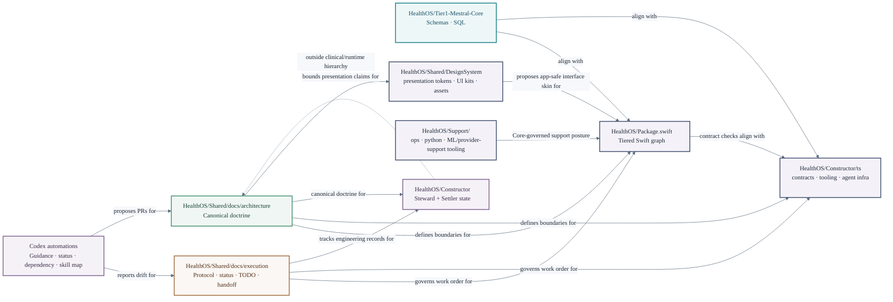

### Code-to-Doc Orientation

| Surface | Primary docs | Primary code |
| :--- | :--- | :--- |
| Core law | `HealthOS/Shared/docs/architecture/06-core-services.md`, `05-data-layers.md`, `07-storage-and-sql.md` | `HealthOS/Tier1-Mestral-Core/Sources/HealthOSCore/` |
| AACI + first slice | `HealthOS/Shared/docs/architecture/09-aaci.md`, `28-first-slice-executable-path.md` | `HealthOS/Tier2-GOS-Runtimes/Sources/HealthOSAACI/`, `HealthOS/Tier2-GOS-Runtimes/Sources/HealthOSSessionRuntime/` |
| MSR | `HealthOS/Shared/docs/architecture/49-mental-space-runtime.md` | `HealthOS/Tier2-GOS-Runtimes/Sources/HealthOSMSR/` |
| GOS | `29-governed-operational-spec.md` → `34-gos-review-and-activation-policy.md` | `HealthOS/Constructor/ts/packages/healthos-gos-tooling/`, `HealthOS/Tier1-Mestral-Core/Sources/HealthOSCore/` |
| Boundary | `HealthOS/Shared/docs/architecture/50-app-layer-boundary-and-reference-apps.md`, `19-interface-doctrine.md` | mediated facades/envelopes in `HealthOS/Tier1-Mestral-Core/Sources/HealthOSCore/` and runtime adapters |
| Native UI + Liquid Glass | `HealthOS/Shared/docs/architecture/48-native-macos-ui-design-system-and-app-shells.md` | `HealthOS/Tier4-Stages-Cast/Scribe/Sources/Scribe/` |
| Stages | `11-scribe.md`, `12-veridia.md`, `13-cloudclinic.md`, `43-cross-app-coordination-shared-surfaces.md` | `HealthOS/Tier4-Stages-Cast/Scribe/Sources/Scribe/`, `HealthOS/Tier4-Stages-Cast/Veridia/Sources/Veridia/`, `HealthOS/Tier4-Stages-Cast/CloudClinic/Sources/CloudClinic/` |
| Providers / ML | `HealthOS/Shared/docs/architecture/16-providers-and-ml.md`, `27-provider-threshold-policy.md` | Runtime adapters: `HealthOS/Tier2-GOS-Runtimes/Sources/HealthOSProviders/`; governed support tooling: `HealthOS/Support/ML/`, `HealthOS/Support/python/` |
| Steward | `45-healthos-xcode-agent.md`, `47-steward-settler-engineering-model.md` | `HealthOS/Constructor/ts/agent-infra/healthos-steward/`, `HealthOS/Constructor/Steward/` |

---

## 📂 Internal Documentation Index

| Module / Folder | README | Focus |
| :--- | :--- | :--- |
| `HealthOS/Tier1-Mestral-Core/Sources/HealthOSCore/` | [README](HealthOS/Tier1-Mestral-Core/Sources/HealthOSCore/README.md) | Core law contracts, governance types, storage, GOS, MSR runtime types, entity model |
| `HealthOS/Tier2-GOS-Runtimes/Sources/HealthOSGOS/` | [README](HealthOS/Tier2-GOS-Runtimes/Sources/HealthOSGOS/README.md) | GOS runtime stub — canonical home for GOS lifecycle; migration from HealthOSAACI in progress |
| `HealthOS/Tier2-GOS-Runtimes/Sources/HealthOSAACI/` | [README](HealthOS/Tier2-GOS-Runtimes/Sources/HealthOSAACI/README.md) | AACI runtime — session capture, GOS binding consumption, draft composition |
| `HealthOS/Tier2-GOS-Runtimes/Sources/HealthOSMSR/` | [README](HealthOS/Tier2-GOS-Runtimes/Sources/HealthOSMSR/README.md) | Mental Space Runtime pipeline — ASL · VDLP · GEM executors, provenance metadata |
| `HealthOS/Tier2-GOS-Runtimes/Sources/HealthOSProviders/` | [README](HealthOS/Tier2-GOS-Runtimes/Sources/HealthOSProviders/README.md) | Runtime provider-adapter module: provider protocol contracts, Apple FoundationModels adapter, stub providers |
| `HealthOS/Tier2-GOS-Runtimes/Sources/HealthOSAsyncRuntime/` | [README](HealthOS/Tier2-GOS-Runtimes/Sources/HealthOSAsyncRuntime/README.md) | Async Runtime stub — job queue and lifecycle; TS reference implementation |
| `HealthOS/Tier2-GOS-Runtimes/Sources/HealthOSUserAgentRuntime/` | [README](HealthOS/Tier2-GOS-Runtimes/Sources/HealthOSUserAgentRuntime/README.md) | User-Agent Runtime stub — patient session lifecycle and sovereignty enforcement |
| `HealthOS/Tier2-GOS-Runtimes/Sources/HealthOSServiceRuntime/` | [README](HealthOS/Tier2-GOS-Runtimes/Sources/HealthOSServiceRuntime/README.md) | Service Runtime stub — professional/service-operations session lifecycle |
| `HealthOS/Tier2-GOS-Runtimes/Sources/HealthOSSessionRuntime/` | — | Session orchestration, normalization executor, Scribe bridge adapter |
| `HealthOS/Tier3-Custom-Boundary/Sources/HealthOSBoundary/` | [README](HealthOS/Tier3-Custom-Boundary/Sources/HealthOSBoundary/README.md) | Boundary compatibility module — Tier 3 facade; Stage executables should consume mediated surfaces through it as it matures |
| `HealthOS/Tier4-Stages-Cast/Scribe/Sources/Scribe/` | [README](HealthOS/Tier4-Stages-Cast/Scribe/Sources/Scribe/README.md) | Scribe validation surface, SwiftUI architecture, Liquid Glass adoption path |
| `HealthOS/Tier4-Stages-Cast/Veridia/Sources/Veridia/` | — | Veridia smoke-testable Stage executable and app-safe patient identity surface |
| `HealthOS/Tier4-Stages-Cast/CloudClinic/Sources/CloudClinic/` | — | CloudClinic smoke-testable Stage executable and service operations placeholder |
| `HealthOS/Shared/DesignSystem/` | [README](HealthOS/Shared/DesignSystem/README.md) | Shared presentation tokens, UI kits, previews, and Stage visual assets |
| `HealthOS/Shared/docs/architecture/` | [index](HealthOS/Shared/docs/architecture/) | 50+ canonical architecture doctrine documents |
| `HealthOS/Shared/docs/execution/` | [README](HealthOS/Shared/docs/execution/README.md) | Execution protocol, status tracking, TODO tracker, maturity/handoff |
| `HealthOS/Constructor/` | [README](HealthOS/Constructor/README.md) | Visible external Construction System root: Steward, Settler, Territory, TS tooling, and structural tests |
| `HealthOS/Constructor/ts/` | [README](HealthOS/Constructor/ts/README.md) | TypeScript workspace: contracts, GOS tooling, runtime reference packages, Steward CLI, Forge MCP, Managed Agent seam |
| `HealthOS/Support/ML/` | [README](HealthOS/Support/ML/README.md) | Create ML/Core ML/MLX scaffolds — transcript normalization; gated by ModelGovernance |
| `HealthOS/Support/` | [README](HealthOS/Support/README.md) | Visible Support root for ops, Python, and governed ML tooling |
| `HealthOS/Constructor/Steward/` | [README](HealthOS/Constructor/Steward/README.md) | Steward derived state, session memory, automation logs |
| `HealthOS/Constructor/ts/agent-infra/healthos-forge-mcp/` | [README](HealthOS/Constructor/ts/agent-infra/healthos-forge-mcp/README.md) | Forge MCP stdio and Streamable HTTP server — 10 deterministic repository-maintenance tools |

---

## 🗂️ Repository Map (current)

- `HealthOS/Shared/docs/architecture/` — canonical architecture and doctrine docs (GOS, app-boundary, regulatory, cross-app, native UI)
- `HealthOS/Shared/docs/execution/` — governed execution protocol, status tracking, coverage, invariants, TODOs, maturity/handoff
- `HealthOS/Tier1-Mestral-Core/Schemas/` — JSON Schema entity contracts and GOS schemas
- `HealthOS/Package.swift` — canonical SwiftPM graph for Core (T1), `HealthOSProviders` runtime adapters plus GOS/AACI/MSR/Runtimes (T2), `CustomSDK` and Boundary (T3), CLI, Support/Construction/Stage-package structural tests, and shared test suites
- `HealthOS/Tier4-Stages-Cast/<Stage>/Package.swift` — separate SwiftPM package per Stage; each Stage depends on the platform package only through `HealthOSBoundary` and `CustomSDK`
- `HealthOS/Constructor/ts/` — workspace packages (`contracts`, `runtime-async`, `runtime-user-agent`, `healthos-gos-tooling`, `healthos-steward`, `healthos-forge-mcp`)
- `HealthOS/Constructor/ts/agent-infra/` — Construction System agent infrastructure (`healthos-steward`, `healthos-forge-mcp`, `healthos-managed-agent`)
- `HealthOS/Constructor/Tests/` — Swift structural tests that keep Construction System files visible and outside the clinical/runtime hierarchy
- `HealthOS/Support/ML/` — Create ML/Core ML/MLX scaffolds for governed local model tooling (transcript normalizer stub; gated by ModelGovernance)
- `HealthOS/Support/python/` — offline ML governance scaffolds only
- `HealthOS/Tier1-Mestral-Core/SQL/migrations/001_init.sql` — canonical metadata schema scaffold
- `HealthOS/Support/ops/` and `scripts/` — local operational scaffolding, bootstrap, network and backup notes
- `HealthOS/Tier4-Stages-Cast/AppDocs/` — interface boundary scaffolds/documentation
- `HealthOS/Constructor/Steward/` — derived Steward state, policies, prompts, session memory
- `HealthOS/Constructor/Steward/memory/automations/` — automation run logs and daily TODO digests
- `HealthOS/Constructor/Settler/` — Settler profiles (`HealthOS/Constructor/Settler/settlers/`) and Territory Registry (`HealthOS/Constructor/Settler/territories/`)
- `.claude/settings.json` — Claude Code settings/MCP configuration; no repository-local scheduled-task registry

---

## Steward, Settlers, and Territories

Steward is the canonical engineering agent for this repository. `healthos-steward` is the CLI, package, and repository-local state root.

- CLI and package: `HealthOS/Constructor/ts/agent-infra/healthos-steward/`
- Repository-local derived state root: `HealthOS/Constructor/Steward/`
- Current persisted runtime state: `HealthOS/Constructor/Steward/memory/sessions/`

Settlers are specialized engineering agent profiles. Settlements are bounded engineering work units. Territories are documented repository domains. Canonical model: `HealthOS/Shared/docs/architecture/47-steward-settler-engineering-model.md`.

```bash
make ts-build
cd HealthOS/Constructor/ts && npx --yes --workspace @healthos/steward healthos-steward status
cd HealthOS/Constructor/ts && npx --yes --workspace @healthos/steward healthos-steward runtime
cd HealthOS/Constructor/ts && npx --yes --workspace @healthos/steward healthos-steward session
cd HealthOS/Constructor/ts && npx --yes --workspace @healthos/steward healthos-steward list territories
cd HealthOS/Constructor/ts && npx --yes --workspace @healthos/steward healthos-steward list settlers
cd HealthOS/Constructor/ts && npx --yes --workspace @healthos/steward healthos-steward list settlements
cd HealthOS/Constructor/ts && npx --yes --workspace @healthos/steward healthos-steward inspect territory <id>
cd HealthOS/Constructor/ts && npx --yes --workspace @healthos/steward healthos-steward inspect settler <id>
cd HealthOS/Constructor/ts && npx --yes --workspace @healthos/steward healthos-steward inspect settlement <id>
cd HealthOS/Constructor/ts && npx --yes --workspace @healthos/steward healthos-steward next
cd HealthOS/Constructor/ts && npx --yes --workspace @healthos/steward healthos-steward generate-prompt <settlement-id>
cd HealthOS/Constructor/ts && npx --yes --workspace @healthos/steward healthos-steward validate-settlement <settlement-id>
cd HealthOS/Constructor/ts && npx --yes --workspace @healthos/steward healthos-steward pr-draft <settlement-id>
cd HealthOS/Constructor/ts && npx --yes --workspace @healthos/steward healthos-steward build-memory
```

Ten `healthos-steward` CLI commands are implemented (ST-010 through ST-017). `dist/` is not committed — run `make ts-build` once before invoking.

**Steward for Xcode** is the Xcode-integration posture: integrates with Xcode Intelligence as an Apple-controlled engineering runtime surface. See `HealthOS/Shared/docs/architecture/45-healthos-xcode-agent.md` for target architecture.

### 🏗️ Construction System Lifecycle

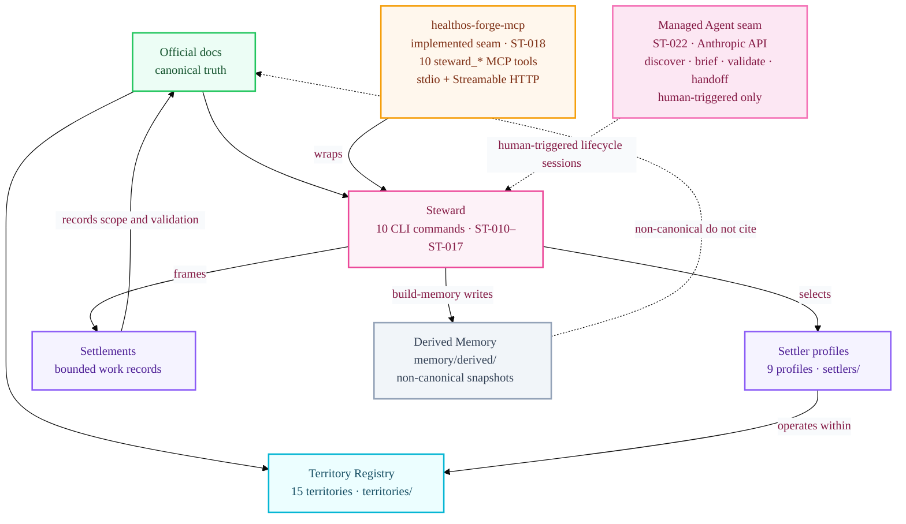

### Managed Agent Seam (ST-022/ST-023)

`@healthos/managed-agent` provides Anthropic Managed Agents API integration for typed construction lifecycle sessions. It is a human-triggered engineering helper, not an autonomous executor or merge authority.

```bash
# Dry-run agent registration (no API call)
cd HealthOS/Constructor/ts && npm run create-agent:dry-run --workspace @healthos/managed-agent

# Live create/update (requires ANTHROPIC_API_KEY or ANTHROPIC_AUTH_TOKEN)
cd HealthOS/Constructor/ts && npm run create-agent --workspace @healthos/managed-agent
```

Typed session workflows: `discover`, `brief`, `validate`, `handoff`. Writes `HealthOS/Constructor/Steward/managed-agent/agent.json` when live. See `HealthOS/Shared/docs/execution/22-steward-construction-operating-model.md`.

Canonical truth resides in `HealthOS/Shared/docs/` and project manifests. Steward memory, Settler scaffolds, Settlement records, and Territory records are derived or instructional engineering surfaces — non-clinical, non-constitutional, and non-authorizing.

---

## 🤖 Repository Maintenance Automations

Scheduled repository maintenance is owned by grouped Codex automations outside the repository, not by a Claude Code cron registry. Read-only jobs report evidence; document-changing jobs must use a worktree/branch and PR handoff, never direct push to `main`.

| Automation group | Cadence | Mode | Function |
| :--- | :--- | :--- | :--- |
| `HealthOScaffold Agent Guidance Maintenance` | Weekly, Tuesday 10:00 | worktree, PR-only | Reviews AGENTS/CLAUDE/README, Steward/Xcode docs, and automation guidance drift |
| `HealthOScaffold Status Digest` | Monday/Wednesday/Friday 08:30 | worktree, read-only | Reports READY/BLOCKED/DONE evidence, tracker inconsistencies, gaps, and next actions |
| `HealthOScaffold Dependency and SDK Drift` | Weekly, Thursday 11:00 | worktree, read-only | Reports manifest, lockfile, SDK, and toolchain drift |
| `HealthOScaffold Retrospective Skill Map` | Every two weeks, Friday 10:00 | worktree, read-only | Suggests concrete skills to deepen from PR/review/commit evidence |

No `.claude/automations/` directory or `.claude/scheduled_tasks.json` file is kept for retired jobs. Historical derived logs may remain under `HealthOS/Constructor/Steward/memory/automations/`, but they are not scheduler definitions.

```mermaid
%%{init: {'theme': 'base', 'themeVariables': {'primaryColor': '#f0fdf4', 'primaryBorderColor': '#86efac', 'primaryTextColor': '#14532d', 'clusterBkg': '#fafafa', 'clusterBorder': '#e2e8f0', 'titleColor': '#0f172a', 'edgeLabelBackground': '#f8fafc', 'fontFamily': 'ui-sans-serif, system-ui, -apple-system'}}}%%
flowchart LR
    classDef trigger fill:#f0fdf4,stroke:#22c55e,stroke-width:2px,color:#14532d
    classDef git     fill:#dbeafe,stroke:#3b82f6,stroke-width:2px,color:#1e3a8a
    classDef read    fill:#fef9c3,stroke:#f59e0b,stroke-width:2px,color:#78350f
    classDef write   fill:#ede9fe,stroke:#8b5cf6,stroke-width:2px,color:#4c1d95
    classDef mem     fill:#fce7f3,stroke:#ec4899,stroke-width:2px,color:#831843

    CRON[Codex cron trigger\nor explicit operator request]:::trigger
    STASH[spawn worktree\nread current main]:::git
    READ[read sources\ndocs · todo · trackers · gaps · git log]:::read
    WRITE[report evidence\nor propose minimal patch]:::write
    COMMIT[branch + PR only\nwhen docs change]:::git
    RESTORE[no direct main push]:::git
    MEM[HealthOS/Constructor/Steward/memory/\nautomations/]:::mem

    CRON --> STASH --> READ --> WRITE --> COMMIT --> RESTORE
    READ -. historical derived logs .-> MEM
```

### Documental Work Plan

`HealthOS/Shared/docs/execution/20-documental-todos-work-plan.md` is the living plan for open documentation tasks. It is no longer edited by a scheduled Claude cron job; update it only through an explicit, scoped work unit with validation and PR handoff.

Phase execution prompts in `HealthOS/Shared/docs/execution/prompts/`:

| Prompt file | Phase | Tasks |
| :--- | :--- | :--- |
| `phase-1-settler-territory.md` | Phase 1 | ST-006 Territory records · ST-002 Settler profiles · ST-003 Settlement schema |
| `phase-2-architecture-proposals.md` | Phase 2 | CL-006 Error envelope · OPS-003 Incident command set · ST-004 healthos-forge-mcp spec |
| `phase-3-xcode-agent-streams.md` | Phase 3 | Stream C tool contracts · Stream D backend contract · Stream F Xcode envelope |

---

## 🧠 Where Agents Should Start

Read in order before coding:

1. `README.md` (this file)
2. `HealthOS/Shared/docs/execution/README.md`
3. `HealthOS/Shared/docs/execution/00-master-plan.md`
4. `HealthOS/Shared/docs/execution/01-agent-operating-protocol.md`
5. `HealthOS/Shared/docs/execution/02-status-and-tracking.md`
6. `HealthOS/Shared/docs/execution/06-scaffold-coverage-matrix.md`
7. `HealthOS/Shared/docs/execution/10-invariant-matrix.md`
8. `HealthOS/Shared/docs/execution/11-current-maturity-map.md`
9. `HealthOS/Shared/docs/execution/12-next-agent-handoff.md`
10. `HealthOS/Shared/docs/execution/13-scaffold-release-candidate-criteria.md`
11. `HealthOS/Shared/docs/execution/14-final-gap-register.md`
12. `HealthOS/Shared/docs/execution/15-scaffold-finalization-plan.md`
13. `HealthOS/Shared/docs/execution/16-next-10-actions-plan.md`
14. `HealthOS/Shared/docs/execution/20-documental-todos-work-plan.md` — living plan for open documentation tasks
15. `HealthOS/Shared/docs/execution/21-structural-ontology-and-product-readiness-plan.md` — **read before selecting any implementation task**; canonical priority-ordered task selection plan
16. `HealthOS/Shared/docs/product/01-healthos-technical-product-specification.md` — **read before generating construction or product work units**; technical product specification baseline
17. `HealthOS/Shared/docs/execution/22-steward-construction-operating-model.md` — construction system operating model
18. `HealthOS/Shared/docs/execution/19-settler-model-task-tracker.md` — ST task sequence and status
19. relevant `HealthOS/Shared/docs/execution/todo/*.md`
20. relevant `HealthOS/Shared/docs/architecture/*.md`
21. matching `HealthOS/Shared/docs/execution/skills/*.md`
22. if touching Swift/SwiftUI/Xcode: `HealthOS/Shared/docs/architecture/48-native-macos-ui-design-system-and-app-shells.md` and matching `HealthOS/Shared/docs/execution/skills/<name>/SKILL.md`

---

## Canonical Hierarchy

```text
HealthOS
  Tier 1 — Mestral Core
    consent, habilitation, storage law,
    provenance, gate, finality, audit
  Tier 2 — GOS / Runtimes
    GOS subordinate operational mediation, never constitutional authority.
    Session Runtime, AACI, MSR, Async Runtime,
    User-Agent Runtime, Service Runtime.
    HealthOSProviders is the runtime provider-adapter module.
  Tier 3 — Custom Boundary
    HealthOS-owned consumption frontier:
    facades, envelopes, safe refs, mediated state,
    degraded state, commands/results, consumable surfaces.
    Custom is the Core-law-governed Stage definition:
    capabilities, limits, consumed surfaces, actors,
    degradation behavior, validation, prohibitions.
  Tier 4 — Stages Cast
    Separate governed Stage universe:
    Scribe, Veridia, CloudClinic, future governed consumers.
    Stages are in the clinical/application environment, but their
    point of contact with the rest of HealthOS is Tier 3 Boundary.

HealthOS/Support
  Shared provider-support tooling, ops, Python, Create ML/Core ML/MLX tooling.
  It is not the HealthOSProviders runtime import target.
  Reachable from Core, runtimes, Stages, and Constructor workflows;
  governed by Core law and ModelGovernance.

Material substrate
  host, storage, private network/mesh, backups,
  APFS + FileVault + Secure Enclave key custody

Artifacts / effects
  drafts, gate records, final artifacts, provenance/audit traces

Constructor / Construction System
  HealthOS/Constructor:
  Steward, Settlers, Territories, Settlements, HealthOS Forge MCP.
  Outside the HealthOS clinical/runtime hierarchy.
```

## Maturity Snapshot by Layer

Full detail: `HealthOS/Shared/docs/execution/11-current-maturity-map.md`.

- **Core law + storage governance:** implemented seam / tested operational path (local scaffold)
- **GOS authoring/compiler/lifecycle:** implemented seam / tested operational path (scaffold hardening)
- **AACI + first slice orchestration:** implemented seam / tested operational path (bounded scope)
- **MSR pipeline:** scaffold — executors present, provenance metadata defined, provider integration pending
- **Liquid Glass UI:** design baseline established; `HealthOS/Shared/DesignSystem/` implemented (DS-001)
- **Construction system (Steward + Forge MCP):** implemented seam — 10 CLI commands + 10 MCP tools deterministic; no LLM, no merge authority, no clinical scope

## Contributing

This repository uses a **branch → PR → merge** workflow. Direct pushes to `main` are not permitted for document-changing or code work.

```bash
# 1. Sync with remote first
git fetch origin --prune
git checkout main && git pull --ff-only

# 2. Create a task branch
git checkout -b <task-type>/<short-description>

# 3. Build and validate before committing
make swift-build
make swift-test
make validate-all   # schemas, contracts, docs

# 4. Commit atomically — docs + contracts + tests together when governing the same change
git add <specific files>
git commit -m "<tier/area>: <concise imperative description>"

# 5. Open a PR to main
gh pr create --title "<short title>" --body "<summary>"
```

**Task selection order** (from `01-agent-operating-protocol.md`):
1. `READY` task in the current phase
2. `BLOCKER` task
3. Documentation/contract task that unblocks coding
4. Validation for just-finished work

After each work unit, update `HealthOS/Shared/docs/execution/02-status-and-tracking.md` and the corresponding `todo/*.md` file.

Read `HealthOS/Shared/docs/execution/21-structural-ontology-and-product-readiness-plan.md` before selecting any implementation task. Read `HealthOS/Constructor/Steward/prompts/prompt-architecture-template.md` before generating any AI coding prompt.

---

## Scaffold/Foundation Phase Closure References

- `HealthOS/Shared/docs/execution/13-scaffold-release-candidate-criteria.md`
- `HealthOS/Shared/docs/execution/14-final-gap-register.md`
- `HealthOS/Shared/docs/execution/15-scaffold-finalization-plan.md`
- `HealthOS/Shared/docs/execution/16-next-10-actions-plan.md`
