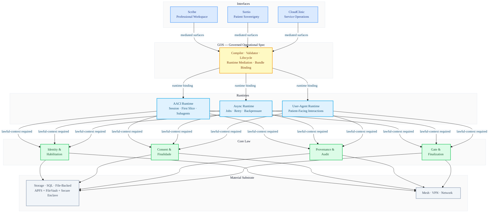
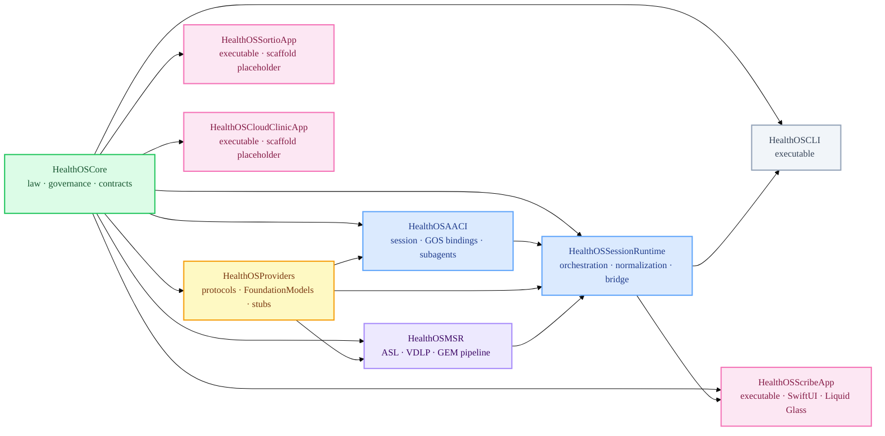
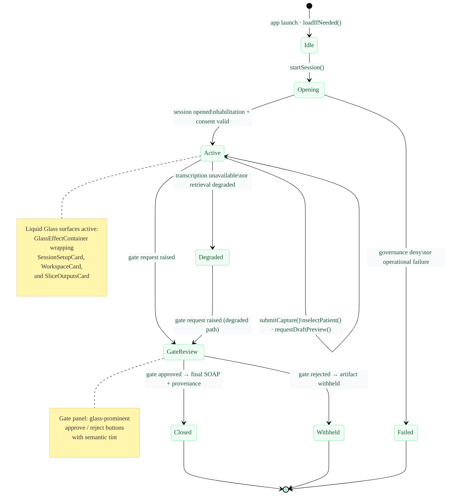
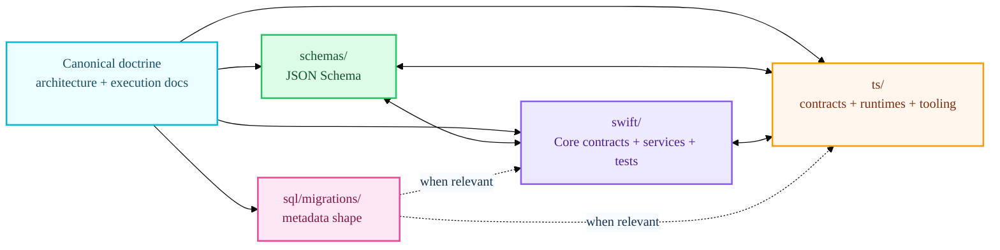
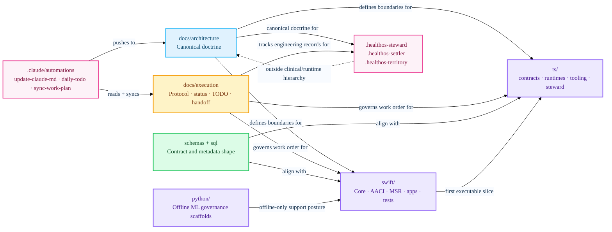
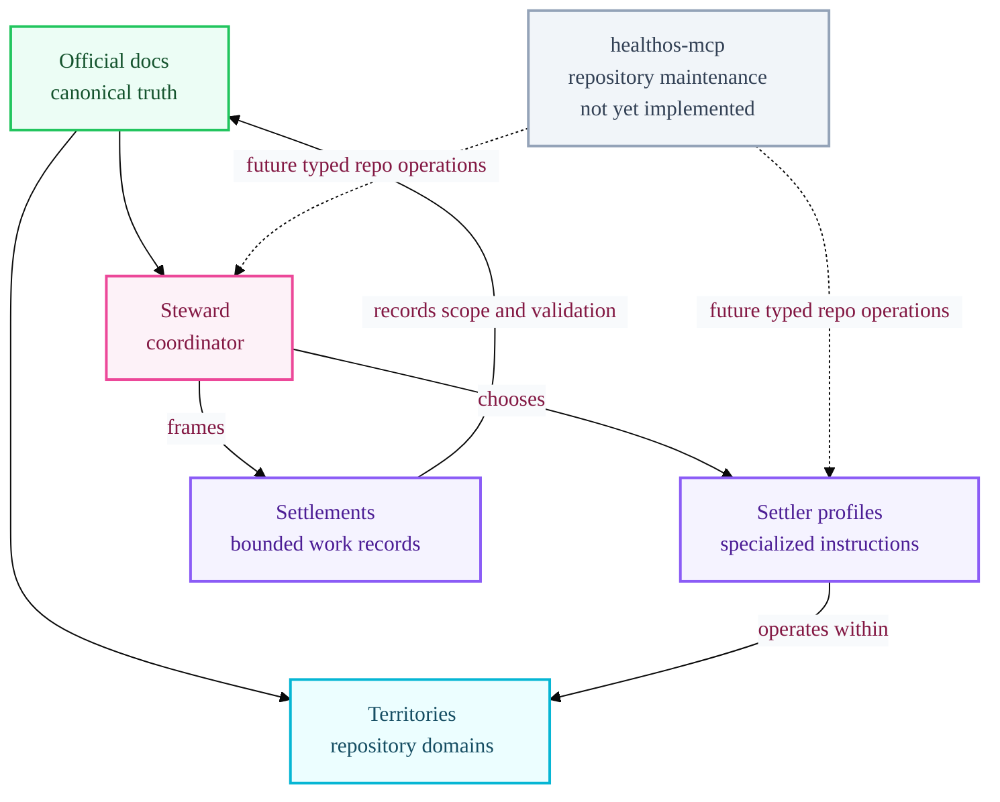

```mermaid
%%{init: {'theme': 'base', 'themeVariables': {'primaryColor': '#f0fdf4', 'primaryBorderColor': '#86efac', 'primaryTextColor': '#14532d', 'clusterBkg': '#fafafa', 'clusterBorder': '#e2e8f0', 'titleColor': '#0f172a', 'edgeLabelBackground': '#f8fafc', 'fontFamily': 'ui-sans-serif, system-ui, -apple-system'}}}%%
flowchart LR
    classDef trigger  fill:#f0fdf4,stroke:#22c55e,stroke-width:2px,color:#14532d
    classDef git      fill:#dbeafe,stroke:#3b82f6,stroke-width:2px,color:#1e3a8a
    classDef read     fill:#fef9c3,stroke:#f59e0b,stroke-width:2px,color:#78350f
    classDef write    fill:#ede9fe,stroke:#8b5cf6,stroke-width:2px,color:#4c1d95
    classDef mem      fill:#fce7f3,stroke:#ec4899,stroke-width:2px,color:#831843

    CRON[Cron trigger\nor manual request]:::trigger
    STASH[stash + checkout main\ngit pull origin main]:::git
    READ[read sources\ndocs · todo · trackers · gaps · git log]:::read
    WRITE[write output\ndoc update or digest]:::write
    COMMIT[git add + commit\ngit push origin main]:::git
    RESTORE[restore branch\ngit stash pop]:::git
    MEM[.healthos-steward/memory/\nautomations/]:::mem

    CRON --> STASH --> READ --> WRITE --> COMMIT --> RESTORE
    WRITE --> MEM
    MEM --> COMMIT
```

<p align="center">
  
</p>

<p align="center">
  
  
  
  
  
  
  
</p>

# HealthOS

> **Sovereign computational environment for health data and clinical operations.**  
> Governance-first architecture — every clinical act mediated through strictly layered contract law.

**HealthOScaffold is the historical repository name for the scaffold/foundation phase of HealthOS.** All implemented architecture, contracts, runtimes, apps, tests, and documentation in this repository are HealthOS work. "Scaffold" describes maturity, not product identity.

**This repository is not production-ready, not a complete EHR, and not a final UI delivery.** It establishes foundational architecture with executable first-slice orchestration, cross-language contracts (Swift / TypeScript / JSON Schema / SQL), and macOS 26+ native app surfaces targeting Liquid Glass as the design baseline.

HealthOS is the full platform. **AACI is one runtime inside HealthOS. GOS is a governed operational layer subordinate to Core law. Scribe, Sortio, and CloudClinic are app/interfaces that consume mediated surfaces; they never define constitutional law.**

---

## 🏗️ Canonical Architecture

HealthOS is a governance-first platform. Every clinical act flows through a strictly layered, consent- and provenance-governed fabric. Apps and interfaces consume only mediated surfaces — they never become law engines.

Steward, Settlers, Settlements, Territories, and `healthos-mcp` are repository engineering concepts outside this clinical/runtime hierarchy. They inspect, edit, validate, and record repository work. They do not become HealthOS law, runtime automation, or clinical effectuation.



### First Slice — Executable Orchestration Path

The current scaffold-level executable path, consumed by `HealthOSCLI` and `HealthOSScribeApp`:


---

## 📦 Swift Package Graph

All nine targets build from `swift/Package.swift` (Swift tools 6.2, platform `.macOS(.v26)`). External dependencies: none — sovereignty by design.



| Target | Kind | Description |
| :--- | :--- | :--- |
| `HealthOSCore` | Library | Core law, governance types, storage contracts, GOS types, MSR runtime types, entity model |
| `HealthOSProviders` | Library | Provider protocol contracts, `AppleFoundationProvider` (FoundationModels), stub providers, model governance |
| `HealthOSAACI` | Library | AACI runtime, GOS bindings, GOS runtime activation/context/resolution |
| `HealthOSMSR` | Library | Mental Space Runtime pipeline — ASL, VDLP, GEM executors, provenance metadata |
| `HealthOSSessionRuntime` | Library | Session orchestration (`SessionRunner`), normalization executor, Scribe bridge adapter |
| `HealthOSCLI` | Executable | Command-line operator interface for session and GOS lifecycle |
| `HealthOSScribeApp` | Executable | Minimal Scribe professional workspace validation surface (SwiftUI, macOS 26+) |
| `HealthOSSortioApp` | Executable | Scaffold placeholder — product-graph representation, no final UI |
| `HealthOSCloudClinicApp` | Executable | Scaffold placeholder — product-graph representation, no final UI |

---

## 🪟 Native Interface Layer — Liquid Glass Design System

HealthOS native macOS surfaces target macOS 26+ and adopt **Liquid Glass as the design baseline** per `docs/architecture/48-native-macos-ui-design-system-and-app-shells.md`.

Standard SwiftUI/AppKit controls and navigation surfaces (sidebars, toolbars, sheets, `NavigationSplitView`) inherit system Liquid Glass behavior automatically. Custom `glassEffect`, `GlassEffectContainer`, and glass button styles are reserved for app-specific HealthOS surfaces not covered by standard controls.

**Current scaffold state:** `HealthOSScribeApp` uses `GroupBox` + `.thinMaterial` with standard SwiftUI controls. Full Liquid Glass adoption is in progress as the macOS 26+ native app shell matures.

<p align="center">
  
</p>

### UI Component Stack

```mermaid
%%{init: {'theme': 'base', 'themeVariables': {'primaryColor': '#f5f3ff', 'primaryBorderColor': '#a78bfa', 'primaryTextColor': '#3b0764', 'clusterBkg': '#fdfbff', 'clusterBorder': '#ddd6fe', 'titleColor': '#0f172a', 'edgeLabelBackground': '#f9f7ff', 'fontFamily': 'ui-rounded, -apple-system, BlinkMacSystemFont, sans-serif'}}}%%
graph TD
    classDef law    fill:#dcfce7,stroke:#22c55e,stroke-width:2px,color:#14532d
    classDef bridge fill:#dbeafe,stroke:#60a5fa,stroke-width:2px,color:#1e3a8a
    classDef vm     fill:#fef9c3,stroke:#f59e0b,stroke-width:2px,color:#78350f
    classDef view   fill:#ede9fe,stroke:#8b5cf6,stroke-width:2px,color:#3b0764
    classDef glass  fill:#fce7f3,stroke:#f472b6,stroke-width:2px,color:#831843
    classDef sys    fill:#f1f5f9,stroke:#94a3b8,stroke-width:1px,color:#475569

    SRT[SessionRunner\norchestration]:::law
    BR[ScribeFirstSliceBridge\nMediated state]:::bridge
    MVM[ScribeFirstSliceViewModel\n@Observable · @MainActor]:::vm

    subgraph VIEWS["  SwiftUI View Layer — HealthOSScribeApp  "]
        APP[WindowGroup\nScribe First Slice]:::view
        ROOT[ScribeFirstSliceView\nScrollView root]:::view
        C1[SurfaceSummaryCard\nGroupBox → GlassEffectContainer]:::glass
        C2[SessionSetupCard\nGroupBox → glass panel]:::glass
        C3[WorkspaceCard\nGroupBox → glass workspace]:::glass
        C4[SliceOutputsCard\nOutputBlock · thinMaterial → glassEffect]:::glass
        C5[IssuesCard\nDegraded state banner]:::glass
        SYSGL[System glass auto-applied\nToolbar · NavigationSplitView · Sheet]:::sys
    end

    SRT --> BR
    BR --> MVM
    MVM --> APP
    APP --> ROOT
    ROOT --> C1
    ROOT --> C2
    ROOT --> C3
    ROOT --> C4
    ROOT --> C5
```

### ScribeFirstSliceView — Session Lifecycle & Glass Surfaces



### Liquid Glass Adoption Map (macOS 26+)

| Surface | Current (scaffold) | macOS 26+ target |
| :--- | :--- | :--- |
| App window | `WindowGroup` | `WindowGroup` + system auto-glass toolbar |
| Navigation | flat `VStack` | `NavigationSplitView` with auto-glass sidebar |
| Session cards | `GroupBox` | `GlassEffectContainer` (one per logical group) |
| Output blocks | `.thinMaterial` | `glassEffect` modifier |
| Gate panel | plain `HStack` buttons | Glass-prominent approve/reject with semantic tint |
| Degraded banner | `.secondary` text | Tinted glass warning surface |
| Issues list | `ForEach` + `Text` | Grouped in single `GlassEffectContainer` |

> **Rule:** group nearby custom glass elements in one `GlassEffectContainer`. Standard controls and navigation surfaces never need explicit glass modifiers — they adapt automatically on macOS 26+. Keep tint semantic, not decorative.

---

## 📋 Current Repository Posture (April 2026)

This repository is in **controlled implementation / scaffold hardening**:

| Layer | Status | Focus |
| :--- | :--- | :--- |
| **Core Law** | ✅ Implemented Seam | Invariant-based governance, storage contracts |
| **GOS Layer** | ✅ Operational Path | Stabilization, bundle binding, compiler tooling |
| **AACI First Slice** | 🚧 Scaffold Hardening | Boundary enforcement + GOS-mediated derived drafts |
| **MSR Pipeline** | 🚧 Scaffold | ASL · VDLP · GEM stages, provenance metadata |
| **Provider / ML** | ⚠️ Stub / Contract | `AppleFoundationProvider` adapter; deterministic safety posture |
| **Apps / UI** | 🧩 Contract-First | Minimal Scribe validation surface; Sortio/CloudClinic placeholder |
| **Liquid Glass UI** | 🎯 macOS 26+ Baseline | Design system defined in architecture docs; glass adoption in progress |

**This repository is not:**
- a production-ready product
- a complete EHR
- a final UI delivery of Scribe, Sortio, or CloudClinic
- a real regulatory-signature or interoperability integration
- a real semantic retrieval stack with embeddings/vector index
- a real external provider deployment (LM/STT/embedding remain scaffold/stub posture)

---

## 🚀 Quick Start

```bash
# Bootstrap all surfaces
make bootstrap

# Build
make swift-build
make ts-build
make python-check

# Test
make swift-test
make ts-test

# Validate contracts and documentation
make validate-schemas
make validate-contracts
make validate-docs
make validate-all
```

**Xcode:** open `HealthOS.xcworkspace` from repository root — resolves `swift/Package.swift`.

**Smoke paths:**

```bash
make smoke-cli
make smoke-scribe
make smoke-sortio
make smoke-cloudclinic
```

**Direct smoke commands:**

```bash
cd swift && swift run HealthOSCLI
cd swift && swift run HealthOSCLI --reject-gate
cd swift && swift run HealthOSScribeApp --smoke-test
cd swift && swift run HealthOSScribeApp --smoke-test-audio
cd swift && swift run HealthOSSortioApp --smoke-test
cd swift && swift run HealthOSCloudClinicApp --smoke-test
```

**GOS bundle lifecycle:**

```bash
cd swift && swift run HealthOSCLI \
  --gos-review-bundle <bundle-id> \
  --gos-spec-id <spec-id> \
  --reviewer-id <id> \
  --review-rationale "<reason>"

cd swift && swift run HealthOSCLI \
  --gos-promote-bundle <bundle-id> \
  --gos-spec-id <spec-id> \
  --activator-id <id> \
  --activation-rationale "<reason>"
```

`HealthOSSortioApp` and `HealthOSCloudClinicApp` are scaffold placeholder executables. They provide honest smoke-testable product-graph representation; they do not implement final UI, session behavior, clinical authority, or production readiness.

---

## 🧩 Cross-Language Contract Discipline

HealthOS is not "just a Swift app" or "just a TypeScript workspace". The same doctrine flows through schemas, Swift, TypeScript, SQL, and execution docs. **When ontology or contracts change, align all four surfaces in the same work unit.**



---

## ✨ Reading Paths

| If you want to… | Start here | Then go to |
| :--- | :--- | :--- |
| Understand what HealthOS is | `docs/architecture/01-overview.md` | `19-interface-doctrine.md`, `46-apple-sovereignty-architecture.md` |
| Understand the executable slice | `docs/architecture/28-first-slice-executable-path.md` | `swift/Sources/HealthOSSessionRuntime/SessionRunner.swift`, `swift/Sources/HealthOSCore/FirstSliceContracts.swift` |
| Understand GOS | `docs/architecture/29-governed-operational-spec.md` | `30-gos-authoring-and-compiler.md` → `33-gos-app-consumption-patterns.md` |
| Understand MSR | `docs/architecture/49-mental-space-runtime.md` | `swift/Sources/HealthOSMSR/`, `swift/Sources/HealthOSCore/MSRRuntime.swift` |
| Understand native UI + Liquid Glass | `docs/architecture/48-native-macos-ui-design-system-and-app-shells.md` | `swift/Sources/HealthOSScribeApp/` |
| Understand Apple sovereignty | `docs/architecture/46-apple-sovereignty-architecture.md` | `swift/Sources/HealthOSProviders/AppleFoundationModelsAdapter.swift` |
| Understand apps and boundaries | `docs/architecture/11-scribe.md` | `12-sortio.md`, `13-cloudclinic.md`, `43-cross-app-coordination-shared-surfaces.md` |
| Understand maturity and gaps | `docs/execution/11-current-maturity-map.md` | `13-scaffold-release-candidate-criteria.md`, `14-final-gap-register.md` |
| Start coding safely | `docs/execution/README.md` | `01-agent-operating-protocol.md`, `02-status-and-tracking.md`, relevant `todo/*.md` |
| Understand Steward for Xcode | `docs/architecture/45-healthos-xcode-agent.md` | `docs/execution/17-healthos-xcode-agent-migration-plan.md` |
| See open documentation tasks | `docs/execution/20-documental-todos-work-plan.md` | `docs/execution/prompts/` |
| See latest daily digest | `.healthos-steward/memory/automations/daily-todo-tracker/latest.md` | `docs/execution/02-status-and-tracking.md` |

### Visual Reading Map

```mermaid
%%{init: {'theme': 'base', 'themeVariables': {'primaryColor': '#eef6ff', 'primaryBorderColor': '#b8d7f5', 'primaryTextColor': '#11324d', 'clusterBkg': '#fbfdff', 'clusterBorder': '#d7e7f5', 'titleColor': '#0f172a', 'edgeLabelBackground': '#f8fbff', 'fontFamily': 'ui-rounded, -apple-system, BlinkMacSystemFont, sans-serif'}}}%%
flowchart TD
    classDef entry   fill:#e8f3ff,stroke:#7db7e8,stroke-width:2px,color:#12324a
    classDef arch    fill:#ecfdf5,stroke:#6fcf97,stroke-width:2px,color:#14532d
    classDef exec    fill:#fff7ed,stroke:#f59e0b,stroke-width:2px,color:#7c2d12
    classDef code    fill:#f5f3ff,stroke:#a78bfa,stroke-width:2px,color:#4c1d95
    classDef steward fill:#fdf2f8,stroke:#ec4899,stroke-width:2px,color:#831843
    classDef ui      fill:#fdf4ff,stroke:#c084fc,stroke-width:2px,color:#581c87

    R[README.md\nEntry Surface]:::entry

    A1[Architecture\n01 overview · 19 doctrine · 46 sovereignty]:::arch
    A2[Execution\nREADME · protocol · status · maturity · gaps]:::exec
    A3[Code Surfaces\nswift · ts · schemas · sql]:::code
    A4[Repository Engineering\nSteward · Settlers · Territories]:::steward
    A5[Claude Code Automations\nupdate · digest · sync]:::steward
    A6[Native UI + Liquid Glass\n48-native-macos-ui · ScribeApp]:::ui

    R --> A1 & A2 & A3 & A4 & A5 & A6

    A1 --> A11[Core law]
    A1 --> A12[GOS]
    A1 --> A13[Apps and interfaces]
    A2 --> A21[What is ready now]
    A2 --> A22[What is blocked]
    A2 --> A23[What to do next]
    A3 --> A31[Executable first slice]
    A3 --> A32[Cross-language contracts]
    A4 --> A41[Steward baseline]
    A4 --> A42[Settler doctrine]
    A6 --> A61[Component contracts]
    A6 --> A62[Glass adoption path]
```



---

## 🗺️ Repository Atlas

The repository is four synchronized surfaces: doctrine, execution discipline, executable code, and cross-language contracts.



### Code-to-Doc Orientation

| Surface | Primary docs | Primary code |
| :--- | :--- | :--- |
| Core law | `docs/architecture/06-core-services.md`, `05-data-layers.md`, `07-storage-and-sql.md` | `swift/Sources/HealthOSCore/` |
| AACI + first slice | `docs/architecture/09-aaci.md`, `28-first-slice-executable-path.md` | `swift/Sources/HealthOSAACI/`, `swift/Sources/HealthOSSessionRuntime/` |
| MSR | `docs/architecture/49-mental-space-runtime.md` | `swift/Sources/HealthOSMSR/` |
| GOS | `29-governed-operational-spec.md` → `34-gos-review-and-activation-policy.md` | `ts/packages/healthos-gos-tooling/`, `swift/Sources/HealthOSCore/` |
| Native UI + Liquid Glass | `docs/architecture/48-native-macos-ui-design-system-and-app-shells.md` | `swift/Sources/HealthOSScribeApp/` |
| Apps/interfaces | `11-scribe.md`, `12-sortio.md`, `13-cloudclinic.md`, `43-cross-app-coordination-shared-surfaces.md` | `swift/Sources/HealthOSScribeApp/`, `HealthOSSortioApp/`, `HealthOSCloudClinicApp/` |
| Providers / ML | `docs/architecture/16-providers-and-ml.md`, `27-provider-threshold-policy.md` | `swift/Sources/HealthOSProviders/` |
| Steward | `45-healthos-xcode-agent.md`, `47-steward-settler-engineering-model.md` | `ts/agent-infra/healthos-steward/`, `.healthos-steward/` |

---

## 📂 Internal Documentation Index

| Module / Folder | README | Focus |
| :--- | :--- | :--- |
| `swift/Sources/HealthOSCore/` | [README](swift/Sources/HealthOSCore/README.md) | Core law contracts, governance types, storage, GOS, MSR runtime types, entity model |
| `swift/Sources/HealthOSScribeApp/` | [README](swift/Sources/HealthOSScribeApp/README.md) | Scribe validation surface, SwiftUI architecture, Liquid Glass adoption path |
| `swift/Sources/HealthOSMSR/` | [README](swift/Sources/HealthOSMSR/README.md) | Mental Space Runtime pipeline — ASL · VDLP · GEM executors, provenance metadata |
| `swift/Sources/HealthOSProviders/` | [README](swift/Sources/HealthOSProviders/README.md) | Provider protocol contracts, Apple FoundationModels adapter, stub providers |
| `docs/architecture/` | [index](docs/architecture/) | 48+ canonical architecture doctrine documents |
| `docs/execution/` | [README](docs/execution/README.md) | Execution protocol, status tracking, TODO tracker, maturity/handoff |
| `ts/` | [README](ts/README.md) | TypeScript workspace: contracts, GOS tooling, async runtime, Steward CLI |
| `.healthos-steward/` | [README](.healthos-steward/README.md) | Steward derived state, session memory, automation logs |

---

## 🗂️ Repository Map (current)

- `docs/architecture/` — canonical architecture and doctrine docs (GOS, app-boundary, regulatory, cross-app, native UI)
- `docs/execution/` — governed execution protocol, status tracking, coverage, invariants, TODOs, maturity/handoff
- `schemas/` — JSON Schema entity contracts and GOS schemas
- `swift/` — Core, AACI, Providers, MSR, SessionRuntime, CLI, Scribe app, XCTest suites
- `ts/` — workspace packages (`contracts`, `runtime-async`, `runtime-user-agent`, `mcp-local`, `healthos-gos-tooling`, `healthos-steward`)
- `python/` — offline ML governance scaffolds only
- `sql/migrations/001_init.sql` — canonical metadata schema scaffold
- `ops/` and `scripts/` — local operational scaffolding, bootstrap, network and backup notes
- `apps/` — interface boundary scaffolds/documentation
- `.healthos-steward/` — derived Steward state, policies, prompts, session memory
- `.healthos-steward/memory/automations/` — automation run logs and daily TODO digests
- `.healthos-settler/` — Settler profile scaffolds (documentation only)
- `.healthos-territory/` — Territory record scaffolds (documentation only)
- `.claude/automations/` — Claude Code automation definitions
- `.claude/scheduled_tasks.json` — durable cron job registry

---

## Steward, Settlers, and Territories

Steward is the canonical engineering agent for this repository. `healthos-steward` is the CLI, package, and repository-local state root.

- CLI and package: `ts/agent-infra/healthos-steward/`
- Repository-local derived state root: `.healthos-steward/`
- Current persisted runtime state: `.healthos-steward/memory/sessions/`

Settlers are specialized engineering agent profiles. Settlements are bounded engineering work units. Territories are documented repository domains. Canonical model: `docs/architecture/47-steward-settler-engineering-model.md`.

```bash
make ts-build
cd ts && npx --yes --workspace @healthos/steward healthos-steward status
cd ts && npx --yes --workspace @healthos/steward healthos-steward runtime --message "inspect repository posture" --dry-run
# session requires an existing session id:
cd ts && npx --yes --workspace @healthos/steward healthos-steward session --id <session-id>
```

Only `status`, `runtime`, and `session` are implemented CLI commands today. Target operations (`scan-status`, `next-task`, `validate-all`, `validate-docs`, `get-handoff`) belong to the planned `healthos-mcp` workstream. Do not describe them as delivered until implemented.



**Steward for Xcode** is the Xcode-integration posture: integrates with Xcode Intelligence as an Apple-controlled engineering runtime surface. See `docs/architecture/45-healthos-xcode-agent.md` for target architecture.

Canonical truth resides in `docs/` and project manifests. Steward memory, Settler scaffolds, Settlement records, and Territory records are derived or instructional engineering surfaces — non-clinical, non-constitutional, and non-authorizing.

---

## 🤖 Claude Code Automations

Three durable automations keep repository state synchronized. All follow **main-first**: pull `origin/main` → read → write → commit → push. Any agent always sees the latest state after a pull.

| Automation | Schedule | Function | Output pushed to `main` |
| :--- | :--- | :--- | :--- |
| `update-claude-md` | Mon 09:03 | Reviews recent git history, Makefile, Steward CLI; updates `CLAUDE.md` with genuinely new commands or patterns | `CLAUDE.md` + memory log |
| `daily-todo-tracker` | Daily 08:07 | Scans all `todo/*.md`, trackers, gap register; writes structured daily digest | `.healthos-steward/memory/automations/daily-todo-tracker/YYYY-MM-DD.md` + `latest.md` |
| `sync-work-plan` | Mon/Wed/Fri 08:47 | Builds truth table for every open documental task; marks completed, unblocks dependencies | `docs/execution/20-documental-todos-work-plan.md` + memory log |

Definitions: `.claude/automations/` · Registry: `.claude/scheduled_tasks.json`

To run any automation immediately: ask Claude Code directly (e.g. *"run the daily-todo-tracker now"*).



### Documental Work Plan

`docs/execution/20-documental-todos-work-plan.md` is the living plan for all open documentation tasks. Kept synchronized by the `sync-work-plan` automation.

Phase execution prompts in `docs/execution/prompts/`:

| Prompt file | Phase | Tasks |
| :--- | :--- | :--- |
| `phase-1-settler-territory.md` | Phase 1 | ST-006 Territory records · ST-002 Settler profiles · ST-003 Settlement schema |
| `phase-2-architecture-proposals.md` | Phase 2 | CL-006 Error envelope · OPS-003 Incident command set · ST-004 healthos-mcp spec |
| `phase-3-xcode-agent-streams.md` | Phase 3 | Stream C tool contracts · Stream D backend contract · Stream F Xcode envelope |

---

## 🧠 Where Agents Should Start

Read in order before coding:

1. `README.md` (this file)
2. `docs/execution/README.md`
3. `docs/execution/00-master-plan.md`
4. `docs/execution/01-agent-operating-protocol.md`
5. `docs/execution/02-status-and-tracking.md`
6. `docs/execution/06-scaffold-coverage-matrix.md`
7. `docs/execution/10-invariant-matrix.md`
8. `docs/execution/11-current-maturity-map.md`
9. `docs/execution/12-next-agent-handoff.md`
10. `docs/execution/13-scaffold-release-candidate-criteria.md`
11. `docs/execution/14-final-gap-register.md`
12. `docs/execution/15-scaffold-finalization-plan.md`
13. `docs/execution/16-next-10-actions-plan.md`
14. relevant `docs/execution/todo/*.md`
15. matching `docs/execution/skills/*.md`
16. if touching Swift/SwiftUI/Xcode: `docs/architecture/48-native-macos-ui-design-system-and-app-shells.md` and matching `docs/execution/skills/<name>/SKILL.md`

---

## Canonical Hierarchy

```text
Material substrate
  └─ host, storage, private network/mesh, backups
     (APFS + FileVault + Secure Enclave key custody)
HealthOS Core
  └─ law/governance (identity, consent, habilitation, storage, provenance, gate, audit)
Governed Operational Spec (GOS)
  └─ operational translation layer subordinate to Core
HealthOS Runtimes
  ├─ AACI runtime (session · first slice · subagents)
  ├─ Async runtime (jobs · retry · backpressure)
  ├─ MSR runtime (ASL · VDLP · GEM pipeline)
  └─ User-Agent runtime (patient-facing interactions)
Actors / Agents
  └─ bounded actors and role-governed agents
Apps / Interfaces  (macOS 26+ · Liquid Glass design baseline)
  ├─ Scribe (professional workspace)
  ├─ Sortio (patient sovereignty)
  └─ CloudClinic (service operations)
Artifacts / Effects
  └─ drafts, gate records, final artifacts, provenance/audit traces
```

## Maturity Snapshot by Layer

Full detail: `docs/execution/11-current-maturity-map.md`.

- **Core law + storage governance:** implemented seam / tested operational path (local scaffold)
- **GOS authoring/compiler/lifecycle:** implemented seam / tested operational path (scaffold hardening)
- **AACI + first slice orchestration:** implemented seam / tested operational path (bounded scope)
- **MSR pipeline:** scaffold — executors present, provenance metadata defined, provider integration pending
- **Liquid Glass UI:** design baseline established; native macOS 26+ adoption in progress

## Scaffold/Foundation Phase Closure References

- `docs/execution/13-scaffold-release-candidate-criteria.md`
- `docs/execution/14-final-gap-register.md`
- `docs/execution/15-scaffold-finalization-plan.md`
- `docs/execution/16-next-10-actions-plan.md`
