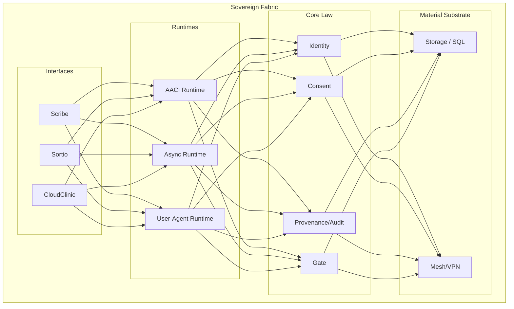

# HealthOScaffold

HealthOS is a sovereign computational environment for health data and clinical operations. This repository is in **controlled implementation / scaffold hardening** phase, establishing foundational architecture.

HealthOS is the full platform. **AACI is one runtime inside HealthOS**. **GOS is a governed operational layer subordinate to Core law**. **Scribe, Sortio, and CloudClinic are app/interfaces that consume mediated surfaces; they never define constitutional law**.

## 🏗️ Canonical Architecture

HealthOS mediates all clinical acts through a strictly layered, governance-first fabric.



## 📋 Current repository posture (April 2026)

This repository is in **controlled implementation / scaffold hardening**:
- multiple cross-language contracts (Swift/TS/JSON Schema/SQL) are executable
- Swift governance and boundary suites are present and runnable
- TypeScript workspace builds; GOS tooling has automated tests
- first-slice execution exists (CLI + minimal Scribe validation surface)

It is **not**:
- a production-ready product
- a complete EHR
- a final UI delivery of Scribe/Sortio/CloudClinic
- a real regulatory-signature/interoperability integration
- a real semantic retrieval stack with embeddings/vector index
- a real external provider deployment (LM/STT/embedding remain scaffold/stub posture)

## 📊 Current Maturity Dashboard

| Layer | Status | Focus |
| :--- | :--- | :--- |
| **Core Law** | ✅ Implemented Seam | Invariant-based governance |
| **GOS Layer** | ✅ Operational Path | Stabilization & Binding |
| **AACI First Slice** | 🚧 Scaffold Hardening | Boundary enforcement |
| **Provider/ML** | ⚠️ Stub/Contract | Deterministic safety |
| **Apps/UI** | 🧩 Contract-First | Minimal validation surface |

## 🚀 Quick Start

```bash
make bootstrap
make swift-build
make swift-test
make ts-build
make ts-test
make python-check
make validate-docs
make validate-schemas
make validate-contracts
make validate-all
```

Optional local smoke path:

```bash
make smoke-cli
make smoke-scribe
```

## 🧠 Where agents should start

Read in order before coding:
1. `README.md`
2. `docs/execution/README.md`
3. `docs/execution/00-master-plan.md`
4. `docs/execution/01-agent-operating-protocol.md`
5. `docs/execution/02-status-and-tracking.md`
6. `docs/execution/06-scaffold-coverage-matrix.md`
7. `docs/execution/10-invariant-matrix.md`
8. `docs/execution/11-current-maturity-map.md`
9. relevant `docs/execution/todo/*.md`
10. matching `docs/execution/skills/*.md`

## 📂 Repository map (real, current)

- `docs/architecture/` — canonical architecture/doctrine docs (including GOS, app-boundary, regulatory, and cross-app waves)
- `docs/execution/` — governed execution protocol, status tracking, coverage, invariants, TODOs, maturity/handoff
- `schemas/` — JSON Schema contracts/entities and GOS schemas
- `swift/` — Core, AACI, Providers, first-slice support, CLI, minimal Scribe app, XCTest suites
- `ts/` — workspace packages (`contracts`, `runtime-async`, `runtime-user-agent`, `mcp-local`, `healthos-gos-tooling`)
- `python/` — offline ML governance scaffolds only
- `sql/migrations/001_init.sql` — canonical metadata schema scaffold
- `ops/` and `scripts/` — local operational scaffolding, bootstrap, network and backup notes
- `apps/` — interface boundary scaffolds/documentation

## 🤖 Project Steward (engineering agent scaffold)

The repository now includes a scaffolded engineering steward CLI at `ts/packages/healthos-steward/` with persistent policy/memory templates under `.healthos-steward/`.

Use it for repository diagnostics/planning/handoff (not clinical runtime behavior):

```bash
cd ts && npx --yes --workspace @healthos/steward healthos-steward status
cd ts && npx --yes --workspace @healthos/steward healthos-steward next-task
cd ts && npx --yes --workspace @healthos/steward healthos-steward prompt codex-next
cd ts && npx --yes --workspace @healthos/steward healthos-steward review-pr --pr 123
```

*Note: Canonical truth resides in `docs/` and project manifests. Steward memory is derived operational state.*

## ⚙️ Provider Orchestration (Model-Agnostic)

`@healthos/steward` supports optional provider adapters (OpenAI, Anthropic, xAI, disabled) with secure defaults:
- providers disabled by default | dry-run first behavior
- no secrets committed | explicit `--post-comment` required for PR comment write

## Canonical hierarchy

```text
Material substrate
  └─ host, storage, private network/mesh, backups
HealthOS Core
  └─ law/governance (identity, consent, habilitation, storage, provenance, gate, audit)
Governed Operational Spec (GOS)
  └─ operational translation layer subordinate to Core
HealthOS Runtimes
  ├─ AACI runtime
  ├─ Async runtime
  └─ User-Agent runtime
Actors / Agents
  └─ bounded actors and role-governed agents
Apps / Interfaces
  ├─ Scribe (professional workspace)
  ├─ Sortio (patient sovereignty)
  └─ CloudClinic (service operations)
Artifacts / Effects
  └─ drafts, gate records, final artifacts, provenance/audit traces
```

## Maturity snapshot by layer

Use `docs/execution/11-current-maturity-map.md` for full detail. Short view:
- Core law + storage governance: **implemented seam / tested operational path (local scaffold)**
- GOS authoring/compiler/lifecycle: **implemented seam / tested operational path (scaffold hardening)**
- AACI + first slice orchestration: **implemented seam / tested operational path (bounded scope)**

## Scaffold RC closure references

For final scaffold-closure auditing and handoff discipline, use:
- `docs/execution/13-scaffold-release-candidate-criteria.md`
- `docs/execution/14-final-gap-register.md`
- `docs/execution/15-scaffold-finalization-plan.md`
- `docs/execution/16-next-10-actions-plan.md`
EOF
