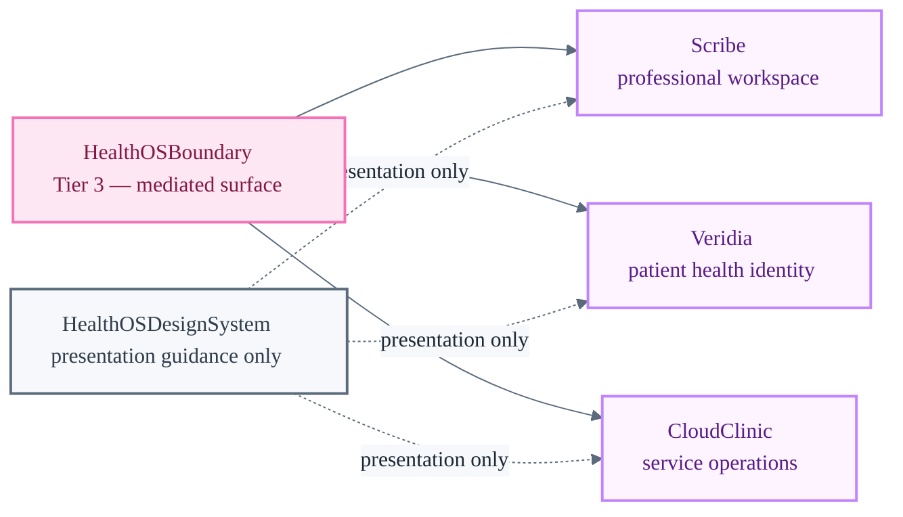

# apps/

Boundary scaffolds and design surface documentation for initial HealthOS Stages.

Stages are consumers of mediated platform surfaces — they never define Core law, constitutional authority, or HealthOS ontology. Each Stage consumes `HealthOSBoundary` (Tier 3) only; it never imports Tier 1/2 modules directly.

---

## Initial Stages

| Stage | Surface | Maturity | Swift target |
| :--- | :--- | :--- | :--- |
| **Scribe** | Professional clinical workspace — session capture, transcript, SOAP draft, gate | Minimal validation surface (SwiftUI, macOS 26+) | `HealthOSScribeStage` |
| **Veridia** | Patient health identity — identity management, consent, access trail, export | Session boundary smoke — no final UI | `HealthOSVeridiaStage` |
| **CloudClinic** | Service operations — service setup, professional onboarding, ops dashboard | Scaffold placeholder — no final UI | `HealthOSCloudClinicStage` |

Full executable surface documentation: [`swift/Sources/`](../swift/Sources/)  
Design system: [`HealthOSDesignSystem/`](../HealthOSDesignSystem/)

---

**None of these Stages are production-ready.**
