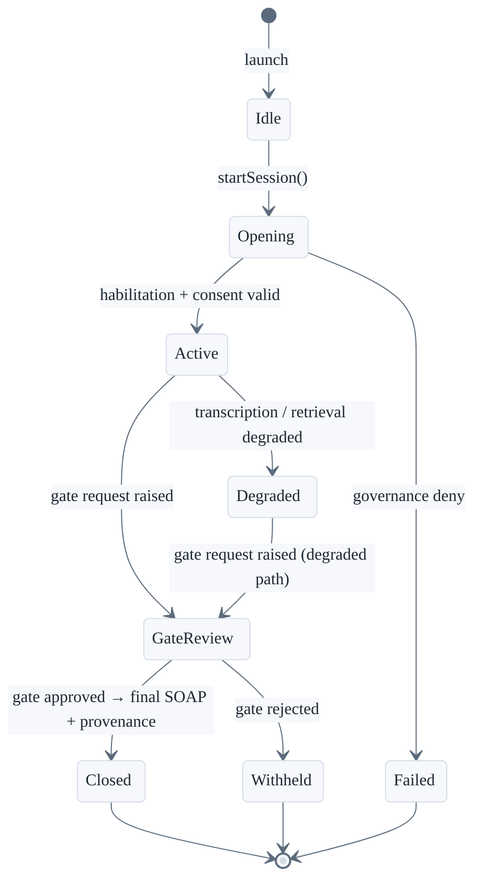

# Scribe

Professional clinical workspace Stage for HealthOS. Scribe consumes `HealthOSBoundary` only and never holds clinical authority, consent law, or Core governance.

**Architecture:** `docs/architecture/11-scribe.md`
**Executable surface:** [`swift/Sources/HealthOSScribeStage/`](../../swift/Sources/HealthOSScribeStage/)
**Design surface:** [`HealthOSDesignSystem/ui_kits/scribe/`](../../HealthOSDesignSystem/ui_kits/scribe/)

## Session Lifecycle

## Screens

| Screen | Purpose |
| :--- | :--- |
| Login / service selection | Identify professional, select service context |
| Active session | Capture, transcript, real-time workspace |
| Context pane | Patient history, retrieved context package |
| Drafts pane | SOAP draft, referral, prescription drafts |
| Gate queue | Clinician review — approve or reject final artifact |
| Session history | Closed sessions and provenance trail |

## Maturity

Minimal SwiftUI validation surface (`HealthOSScribeStage`) is operational for smoke testing.
Full Liquid Glass UI shell, final gate panel, and derived-draft workflows are pending Tier 2 stabilization.
Scribe never owns governance law — all authority flows via `HealthOSBoundary`.
