# Veridia

Patient health identity Stage for HealthOS. Veridia gives patients governed access to their identity, consent state, data custody, and export controls via `HealthOSBoundary`. It never defines Core law or holds clinical authority.

**Architecture:** `docs/architecture/12-veridia.md`
**Executable surface:** [`swift/Sources/HealthOSVeridiaStage/`](../../swift/Sources/HealthOSVeridiaStage/)
**Design surface:** [`HealthOSDesignSystem/ui_kits/veridia/`](../../HealthOSDesignSystem/ui_kits/veridia/)
**Runtime:** `HealthOSUserAgentRuntime` (Tier 2) via `HealthOSBoundary`

## Screens

| Screen | Purpose |
| :--- | :--- |
| Identity | Health identity summary, habilitation status |
| Keys and access | Mediated key custody controls |
| My data | Owned-data visibility — governed, never raw identifiers |
| Consent center | Consent record, visible scopes, actions where permitted |
| Access trail | Audit visibility — who accessed what and when |
| Exports | Governed export requests and status |
| Patient agent | Patient-sovereign agent interactions |

## Session Boundary

```mermaid
%%{init: {'theme': 'base', 'themeVariables': {'primaryColor': '#F6F8FB', 'primaryBorderColor': '#D6DEE8', 'primaryTextColor': '#1D2733', 'lineColor': '#5B6B7C', 'edgeLabelBackground': '#F6F8FB', 'fontFamily': 'ui-rounded, -apple-system, BlinkMacSystemFont, sans-serif'}}}%%
flowchart LR
    classDef boundary fill:#fce7f3,stroke:#f472b6,stroke-width:2px,color:#831843
    classDef stage    fill:#fdf4ff,stroke:#c084fc,stroke-width:2px,color:#581c87
    classDef runtime  fill:#dbeafe,stroke:#60a5fa,stroke-width:2px,color:#1e3a8a
    classDef core     fill:#dcfce7,stroke:#22c55e,stroke-width:2px,color:#14532d

    VE[Veridia\nStage]:::stage
    AB[HealthOSBoundary\nTier 3]:::boundary
    UAR[HealthOSUserAgentRuntime\nTier 2]:::runtime
    CORE[HealthOSCore\nlaw · consent · identity]:::core

    VE -->|imports only| AB
    AB -->|mediates| UAR
    UAR -->|lawful context| CORE
```

## Maturity

Session boundary is smoke-testable (`HealthOSVeridiaStage --smoke-test`).
No final UI shell is implemented. All screens are contract-first — `VeridiaSessionContracts.swift` and `UserSovereigntyContracts.swift` define the mediated surface.
`HealthOSVeridiaStage` currently retains a direct `HealthOSCore` dependency pending `HealthOSBoundary` facade completion (marked TODO in `swift/Package.swift`).
