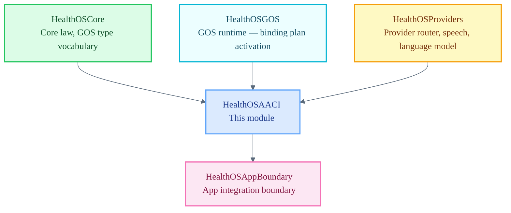

# HealthOSAACI

Ambient Awareness and Contextual Intelligence — one runtime inside HealthOS.

`HealthOSAACI` is a Tier 2 module. It is one runtime inside HealthOS — not the platform definition, not a law engine, and not a consent or gate authority. It owns session capture, transcription lifecycle, bounded context retrieval, draft composition, and GOS binding consumption. All authority flows into AACI from `HealthOSCore` through GOS binding plans; AACI enforces draft-only boundaries and never effectuates clinical artifacts.

## Architecture Position

## Responsibilities

- Orchestrate session capture via `AACIOrchestrator` (actor)
- Run the transcription lifecycle: capture mode selection, provider routing, degraded-state handling
- Compose structured drafts (SOAP, referral, prescription) from bounded session and context materials
- Consume `GOSRuntimeBindingPlan` instances to mediate draft composition and enforce draft-only boundaries
- Route provider calls through `ProviderRouter`; deny remote fallback unless policy explicitly permits it
- Expose named sub-agents (`CaptureAgent`, `TranscriptionAgent`, `DraftComposerAgent`, etc.) with explicit actor boundaries

## File Map

| File | Domain |
| :--- | :--- |
| `AACI.swift` | `AACIOrchestrator` actor, all sub-agent structs, draft composition logic, heuristic helpers |
| `GOSBindings.swift` | `AACIGOSBindings` — default GOS primitive binding plan for all AACI actors |
| `GOSRuntimeActivation.swift` | GOS bundle activation surface (temporary resident — migrates to `HealthOSGOS`) |
| `GOSRuntimeContext.swift` | GOS runtime context types: `AACIActiveGOSRuntime`, `AACIResolvedGOSRuntimeView` (temporary resident) |
| `GOSRuntimeResolution.swift` | `AACIGOSRuntimeResolver` — mediation context resolution and path classification (temporary resident) |

**Migration note:** `GOSBindings.swift`, `GOSRuntimeActivation.swift`, `GOSRuntimeContext.swift`, and `GOSRuntimeResolution.swift` will migrate to `HealthOSGOS` in a dedicated task. They reside here temporarily to keep the first-slice path operational.

## Current Maturity

**Implemented seam (scaffold boundary).** `AACIOrchestrator` and the ten sub-agents are implemented and operational within the bounded first-slice scope. Draft composition paths (SOAP, referral, prescription) are functional with explicit draft-only enforcement. Provider routing through `ProviderRouter` is operational for seeded-text and local-audio capture modes. Remote provider fallback remains denied by policy.

GOS binding consumption is implemented via `AACIGOSRuntimeResolver` and `AACIResolvedGOSRuntimeView`. The binding plan covers all ten AACI actors with their primitive family assignments.

Validation: `cd swift && swift build && swift test`

## Key Invariants

- AACI holds no Core law authority. Consent, habilitation, gate, finality, and storage governance remain in Core.
- Every draft artifact must carry `status: .awaitingGate` or `status: .draft`; AACI never effectuates a final artifact.
- Stub-only or unavailable providers must produce an explicit degraded `TranscriptionOutput`; stub output must not be persisted as a real normalized transcript.
- Remote provider fallback is denied unless future policy explicitly enables it.
- GOS binding consumption must attach resolved GOS metadata to draft payloads; drafts produced without GOS mediation are permitted only when no active GOS runtime is installed.
- All draft-composition actors must enforce the human-gate boundary string when `requiresHumanGateByBinding` is true.
