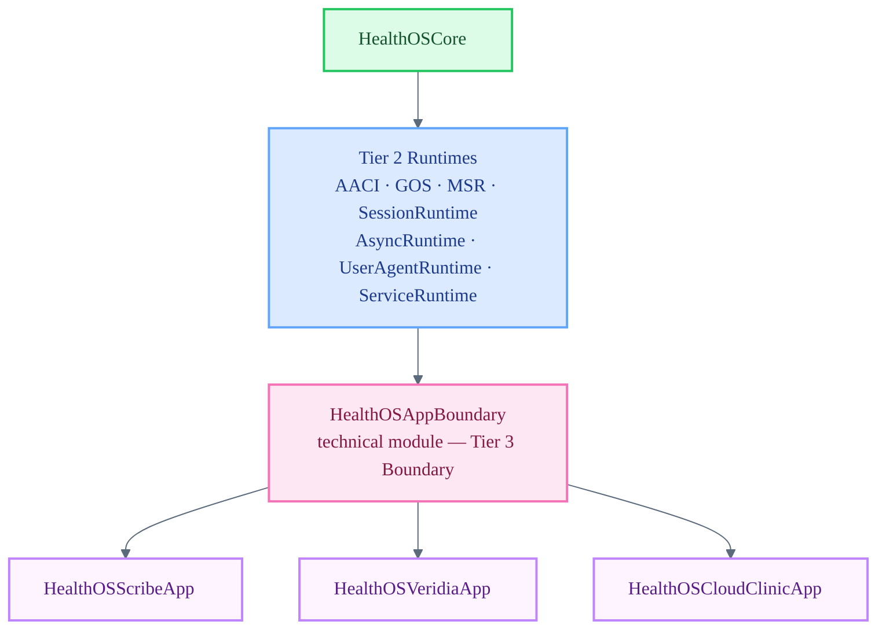

# HealthOSAppBoundary

Boundary compatibility module — the intended import surface for Stage executables as this tier matures.

`HealthOSAppBoundary` preserves the current technical module name while the canonical conceptual layer is **Boundary**. It is the Tier 3 gateway between Core/GOS/Runtimes and Stage implementations. No Stage should import `HealthOSCore`, `HealthOSAACI`, `HealthOSSessionRuntime`, or any other Tier 1–2 module directly once the Boundary module is complete. All Stage-facing surfaces — session facades, mediated state, safe refs, command/result envelopes, and degraded-state views — are exposed through this module as the facade matures.

## Architecture Position

## Responsibilities

- Expose app-safe session surfaces — facades that wrap `HealthOSSessionRuntime` without leaking internal types
- Provide mediated state views, safe object references, command envelopes, and result envelopes
- Surface degraded-state representations so Stages can render gracefully when Tier 2 runtimes are unavailable
- Enforce the Boundary contract: no raw direct identifiers, no GOS spec JSON, no provider secrets, no storage paths reach Stage code
- Remain the single dependency point; adding a new Tier 2 surface to Stages always goes through this module first

## File Map

| File | Domain |
| :--- | :--- |
| `AppBoundary.swift` | Placeholder enum — facade implementation pending Tier 2 surface stabilization |

## Current Maturity

**Stub / scaffold.** `AppBoundary.swift` imports all upstream Tier 2 modules and declares the namespace, but no facades or envelopes are implemented. Facade implementation is blocked on Tier 2 surface stabilization.

Known deviations (marked as TODO in `Package.swift`):
- `HealthOSVeridiaApp` retains a direct dependency on `HealthOSCore` and `HealthOSSessionRuntime` pending AppBoundary completion.
- `HealthOSScribeApp` retains a direct dependency on `HealthOSCore` and `HealthOSSessionRuntime` pending AppBoundary completion.

These deviations are tracked and must be resolved before Stage executables are considered Boundary-compliant.

Architecture reference: `docs/execution/21-structural-ontology-and-product-readiness-plan.md`

## Key Invariants

- Stage executables must import `HealthOSAppBoundary` only once the facade is complete — never any Tier 1–2 module directly.
- Raw direct identifiers (CPF, name, DOB in unmasked form) must never appear in any type exported by this module.
- Degraded-state views must be accurate; they must not claim availability that Tier 2 has not confirmed.
- Facade implementations must not bypass Core law checks (consent, habilitation, gate, finality, provenance).
- Stage wiring advances only after the mediated surface it consumes is implemented and stable at Tier 2 and the relevant Custom is complete.
