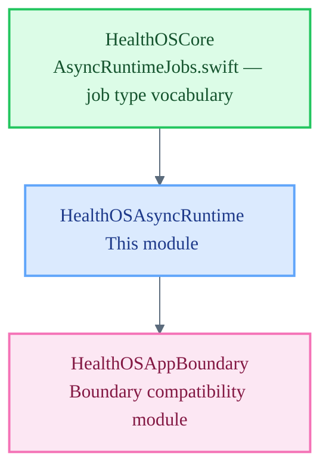

# HealthOSAsyncRuntime

Async Runtime — durable job queue and async task lifecycle for HealthOS.

`HealthOSAsyncRuntime` is a Tier 2 module subordinate to `HealthOSCore`. It owns durable job scheduling, async task lifecycle, idempotency enforcement, retry policy, and dead-lettering for background work within the HealthOS platform. It holds no consent, gate, or storage layer authority; all such decisions remain in Core law and are passed in as lawful context on each job submission.

## Architecture Position

## Responsibilities

- Maintain a durable, in-process job registry keyed by job kind and idempotency token
- Execute async tasks within Core-governed lifecycle hooks (submit → running → completed / dead-lettered)
- Enforce retry policy and backpressure as defined in `HealthOSCore/AsyncRuntimeJobs.swift`
- Emit audit envelope entries for every job state transition
- Surface dead-letter state explicitly rather than silently discarding failed jobs

## File Map

| File | Domain |
| :--- | :--- |
| `AsyncRuntime.swift` | Placeholder enum — job registry, lifecycle hooks, and audit envelope pending implementation |

## Current Maturity

**Scaffold stub.** `AsyncRuntime.swift` declares the module namespace only. Job registry, lifecycle hooks, retry logic, and the audit envelope are not yet implemented.

The TypeScript async runtime at `ts/packages/runtime-async/` currently holds the reference implementation. The Swift target in this module is the native-side counterpart and is expected to mirror the same lifecycle model once implemented.

Type vocabulary cross-reference: `HealthOSCore/AsyncRuntimeJobs.swift`

## Key Invariants

- No consent, gate, or storage authority resides in this module.
- Every job submission must carry a `lawfulContext` and a finalidade; jobs submitted without them must be rejected at the registry boundary.
- Dead-lettered jobs must be recorded with cause; silent discard is forbidden.
- Retry must respect backpressure limits defined in Core; unlimited retry is forbidden.
- Audit envelope entries are required for every lifecycle transition — submit, start, complete, fail, dead-letter.
