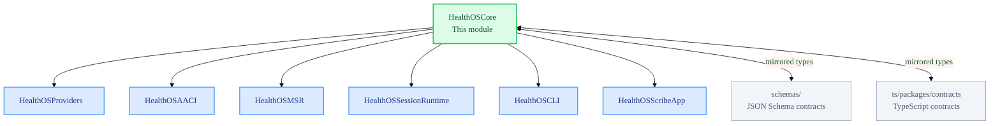

# HealthOSCore

Core law, governance types, and contract seams for the entire HealthOS platform.

`HealthOSCore` is the constitutional foundation. All other Swift targets depend on it. It contains no business logic, no provider calls, and no UI. It defines the invariants, type vocabulary, and seam contracts that every runtime, app, and engineering surface must honor.

## Responsibility

- Define and enforce HealthOS **Core Law**: identity/habilitation, consent/finalidade, provenance/audit, gate/finalization, storage governance, reidentification governance, backup governance
- Provide the canonical **entity model** (`Usuario`, `Servico`, `SessionCaptureInput`, etc.)
- Define **cross-language contract seams** — types here are mirrored in JSON Schema and TypeScript contracts
- Expose the **GOS type vocabulary** consumed by `HealthOSAACI` and GOS tooling
- Host the **MSR runtime type layer** (stage types, artifact metadata, provenance shapes) consumed by `HealthOSMSR`
- Provide the **async runtime job types** for the async runtime
- Define the **actor model** and service boundary vocabulary

## File Map

| File | Domain |
| :--- | :--- |
| `CoreLaw.swift` | Core law invariants, `lawfulContext` validation seam |
| `Entities.swift` | Canonical entity types: `Usuario`, `Servico`, `SessionCaptureInput` |
| `CanonicalTypes.swift` | Shared vocabulary: dispositions, issues, failure kinds, codes |
| `FirstSliceContracts.swift` | First-slice command/response contracts consumed by `SessionRunner` |
| `GateContracts.swift` | Gate request/resolve types, gate state vocabulary |
| `GovernedOperationalSpec.swift` | GOS type vocabulary: spec, bundle, binding plan, lifecycle |
| `GOSFileBackedRegistry.swift` | File-backed GOS spec registry seam |
| `StorageContracts.swift` | Storage layer contracts, `lawfulContext` storage seam |
| `MSRRuntime.swift` | MSR stage types, `MSRArtifactMetadata`, provenance metadata shape |
| `TranscriptNormalization.swift` | Transcript normalization state types |
| `Provenance.swift` | Provenance record types and audit surface |
| `ActorModel.swift` | Actor and role vocabulary for GOS-mediated operations |
| `AsyncRuntimeJobs.swift` | Async job kinds and retry/backpressure vocabulary |
| `ScribeFirstSliceBridge.swift` | `ScribeSessionBridgeState` — mediated state surface for Scribe |
| `ScribeProfessionalWorkspaceContracts.swift` | Scribe app-safe screen contracts |
| `ServiceOperationsContracts.swift` | CloudClinic service-operations contracts |
| `UserSovereigntyContracts.swift` | Sortio patient-sovereignty contracts |
| `CrossAppCoordinationContracts.swift` | Shared surfaces for cross-app coordination |
| `FirstSliceServices.swift` | `ScribeFirstSliceFacade` protocol and service entry points |
| `ServiceBoundaryOutcome.swift` | Service boundary result vocabulary |
| `BackupGovernance.swift` | Backup governance seam |
| `RegulatoryGovernance.swift` | Regulatory/interoperability governance contracts |
| `ReidentificationGovernance.swift` | Reidentification risk governance seam |
| `RetrievalMemoryGovernance.swift` | Retrieval context governance types |
| `SharedEnvelopeVocabulary.swift` | Shared envelope types for cross-surface messaging |
| `DirectoryLayout.swift` | Canonical directory layout constants |

## Architecture Position

## Invariants

Core law is enforced through the invariant matrix (`docs/execution/10-invariant-matrix.md`). Key invariants guarded in this module:

- **Inv 3** — `lawfulContext` required on every session act
- **Inv 4** — consent must be valid before any clinical capture
- **Inv 6** — gate must be resolved before artifact effectuation
- **Inv 9** — provenance record required for every draft/final artifact
- **Inv 14** — `lawfulContext` validation on every storage read/write
- **Inv 15** — storage layer separation enforcing sensitivity semantics

These invariants are never relaxed for scaffolding convenience. Fail-closed behavior is permanent.

## Usage Notes

- Do not add business logic or provider calls to this module.
- Do not expose raw direct identifiers (`cpfHash`, reidentification mappings) through app-facing surfaces.
- When adding new contract types, mirror the change to `schemas/` and `ts/packages/contracts/` in the same work unit.
- `ScribeFirstSliceBridge.swift` is the **only** mediated state surface Scribe app is permitted to read — it must never expose raw storage paths, GOS spec JSON, provider secrets, or clinical payload dumps.
