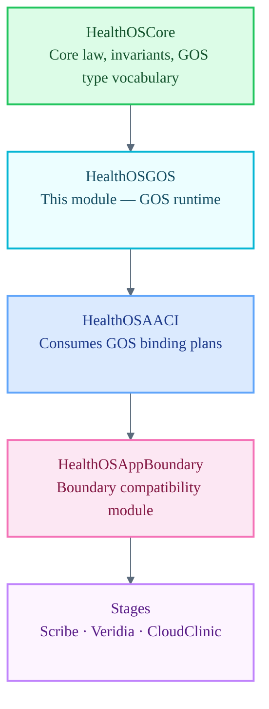

# HealthOSGOS

Governed Operational Spec (GOS) runtime — operational mediation layer for HealthOS.

`HealthOSGOS` is a Tier 2 runtime module subordinate to `HealthOSCore`. GOS translates Core-governed invariants into runtime-operational spec bundles that other Tier 2 runtimes — primarily `HealthOSAACI` — consume as binding plans. GOS is operational mediation authority, never constitutional authority. Core law is sovereign; GOS operates within it.

## Architecture Position

## Responsibilities

- Activate and resolve GOS spec bundles from the file-backed registry (`HealthOSCore/GOSFileBackedRegistry.swift`)
- Produce `GOSRuntimeBindingPlan` instances consumed by `HealthOSAACI` and other Tier 2 runtimes
- Enforce that all spec promotion, activation, and binding operations are traceable and provenance-recorded
- Mediate between Core-governed invariants and per-actor operational runtime behavior
- Reject or degrade gracefully when a requested spec is absent, malformed, or fails invariant checks

## File Map

| File | Domain |
| :--- | :--- |
| `GOSRuntime.swift` | Placeholder enum — canonical home for GOS runtime surface once migrated |

## Current Maturity

**Stub module.** `GOSRuntime.swift` declares the module namespace only. The operative GOS runtime files — `GOSBindings.swift`, `GOSRuntimeActivation.swift`, `GOSRuntimeContext.swift`, and `GOSRuntimeResolution.swift` — currently reside in `HealthOSAACI` and are scheduled for migration to this module in a dedicated task. Until that migration completes, `HealthOSGOS` is not the active GOS execution surface.

Architecture references:
- `docs/architecture/29-governed-operational-spec.md`
- `HealthOSCore/GovernedOperationalSpec.swift` — GOS type vocabulary

## Key Invariants

- GOS never holds constitutional authority. `HealthOSCore` is sovereign.
- GOS spec activation must produce a provenance record.
- A failed or missing spec must degrade gracefully; it must never silently substitute an unauthorized default.
- Apps must never consume GOS bindings directly — only through `HealthOSAACI` mediation via `HealthOSAppBoundary`.
- Do not move consent, habilitation, gate, or finality logic into GOS. Those belong to Core law.
