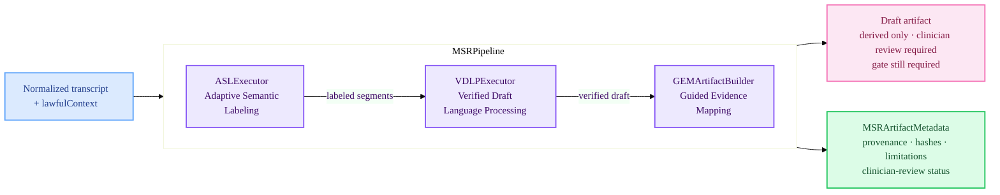

# HealthOSMSR

Mental Space Runtime — three-stage AI pipeline for clinical draft reasoning within HealthOS governance.

`HealthOSMSR` implements the MSR pipeline as defined in `docs/architecture/49-mental-space-runtime.md`. It orchestrates three sequential reasoning stages (ASL → VDLP → GEM) over a governance-validated transcript, producing draft artifacts with full provenance metadata. Every MSR output is classified as a **derived artifact only** — it is never a final clinical record and always requires clinician review and gate resolution before effectuation.

## Architecture



## Stages

| Stage | Executor | Purpose |
| :--- | :--- | :--- |
| **ASL** | `ASLExecutor.swift` | Adaptive Semantic Labeling — segments and labels transcript content into clinical semantic units |
| **VDLP** | `VDLPExecutor.swift` | Verified Draft Language Processing — composes a verified draft from labeled segments |
| **GEM** | `GEMArtifactBuilder.swift` | Guided Evidence Mapping — maps evidence references and assembles the final draft artifact |

Each executor uses `MSRJSONRepair.swift` for resilient JSON parsing of model output (handles partial/malformed responses from stub and real providers).

## File Map

| File | Purpose |
| :--- | :--- |
| `MSRPipeline.swift` | Pipeline entry point — sequences ASL → VDLP → GEM, enforces provenance, returns `MSRRuntimeState` |
| `Executors/ASLExecutor.swift` | Stage 1: Adaptive Semantic Labeling |
| `Executors/VDLPExecutor.swift` | Stage 2: Verified Draft Language Processing |
| `Executors/GEMArtifactBuilder.swift` | Stage 3: Guided Evidence Mapping + artifact assembly |
| `Executors/MSRJSONRepair.swift` | JSON repair utility for resilient model output parsing |
| `Prompts/` | Stage-specific prompt resources (`.copy` resource bundle) |

## Provenance

Every MSR artifact carries `MSRArtifactMetadata` (defined in `HealthOSCore/MSRRuntime.swift`):

```swift
public struct MSRArtifactMetadata: Codable, Sendable, Equatable {
    public let stage: MSRStage           // .asl | .vdlp | .gem
    public let sourceTranscriptRef: String
    public let stageVersion: String
    public let promptVersion: String
    public let modelProvider: String
    public let modelId: String?
    public let inputHash: String
    public let outputHash: String
    public let lawfulContextSummary: String
    public let clinicianReviewStatus: MSRClinicianReviewStatus
    public let limitations: [String]
    public let legalAuthorizing: Bool    // always false for MSR derived artifacts
    public let gateStillRequired: Bool   // always true until gate resolves
}
```

## Current Maturity

| Aspect | Status |
| :--- | :--- |
| Pipeline orchestration | ✅ Scaffold implemented |
| Stage executor shells | ✅ Present |
| Provenance metadata | ✅ Defined and typed |
| Prompt resources | ✅ Bundled |
| Provider integration | ⚠️ Stub posture — uses `HealthOSProviders` stub or `AppleFoundationProvider` |
| Clinician review workflow | 🧩 Contract-first — `MSRClinicianReviewStatus` typed, workflow pending |
| Gate integration | 🧩 `gateStillRequired: true` enforced; gate resolution wired through `SessionRunner` |

## Key Invariants

- All MSR outputs are `derivedArtifactsOnly: true` and `legalAuthorizing: false`.
- `gateStillRequired` is always `true` until `SessionRunner` receives an approved gate resolution.
- Provider calls respect `ProviderCapabilityProfile` sovereignty constraints — non-Apple providers require explicit policy, degraded-sovereignty classification, and provenance markers.
- Never claim MSR output as a final clinical record, regulatory document, or provider-signed artifact.
