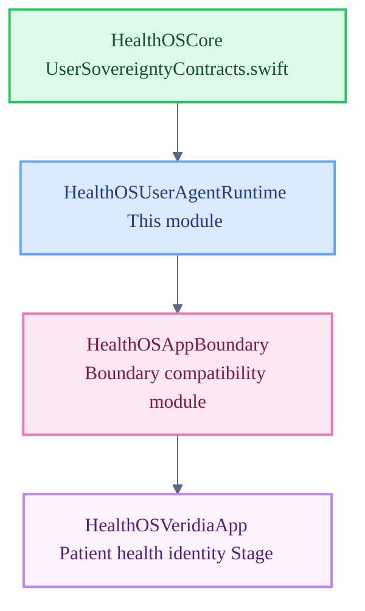

# HealthOSUserAgentRuntime

User-Agent Runtime — patient and user-side session lifecycle and sovereignty enforcement for HealthOS.

`HealthOSUserAgentRuntime` is a Tier 2 module subordinate to `HealthOSCore`. It owns the patient/user-facing session surface: sovereignty enforcement, consent execution, user-sovereign state management, and audit trail for user-initiated actions. It is not constitutional authority and does not hold consent law — it executes consent operations as delegated by Core.

## Architecture Position

## Responsibilities

- Manage user-sovereign session state: initialization, active, suspended, and terminated lifecycle states
- Execute consent grant and revocation operations delegated by Core law
- Enforce that no raw direct patient identifiers (CPF, name, date of birth) are stored or transmitted in unmasked form
- Produce per-action audit trail entries for every user-sovereign state transition
- Surface user-facing degraded states when upstream Tier 2 runtimes are unavailable

## File Map

| File | Domain |
| :--- | :--- |
| `UserAgentRuntime.swift` | Placeholder enum — user-sovereign session surface, consent execution, and audit trail pending implementation |

## Current Maturity

**Scaffold stub.** `UserAgentRuntime.swift` declares the module namespace only. The user-sovereign session surface, consent execution path, identifier masking enforcement, and audit trail are not yet implemented.

`HealthOSVeridiaApp` (technical executable for the patient health identity Stage) is the primary Stage consumer of this runtime via `HealthOSAppBoundary`. Veridia Stage wiring to this surface is blocked until the mediated session surface is implemented and stable.

Type vocabulary cross-reference: `HealthOSCore/UserSovereigntyContracts.swift`

## Key Invariants

- This module does not hold consent law. It executes consent operations as directed by Core.
- Raw direct patient identifiers must never be stored, logged, or transmitted by this module.
- Every consent state transition must produce a provenance record.
- User-sovereign session state must fail closed: if Core invariant checks fail, the session must not proceed.
- Degraded states must be surfaced explicitly — silent availability claims are forbidden.
