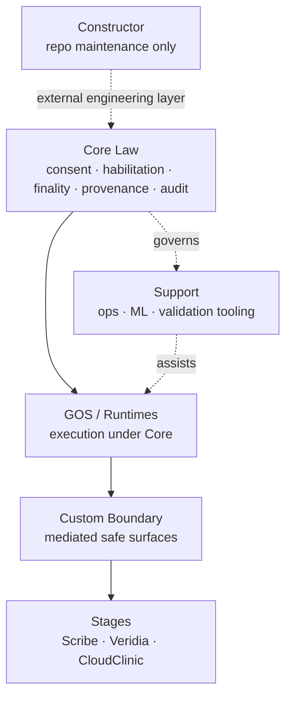

# Conceptual Map

> HealthOS is easiest to understand as a governed execution environment with constitutional law at the center, mediated runtimes beneath applications, and Stage applications consuming only safe Boundary surfaces.

---

## The canonical layers

| Layer | Name | Responsibility |
| :--- | :--- | :--- |
| Tier 1 | Mestral Core | Constitutional law: identity, habilitation, consent, finality, provenance, audit, lawful context. |
| Tier 2 | GOS / Runtimes | Execution mediation: sessions, capture, async jobs, service operations, user-agent runtime, providers, MSR, AACI. |
| Tier 3 | Custom Boundary | HealthOS-owned consumption frontier: facades, envelopes, safe references, Stage-defined capabilities and prohibitions. |
| Tier 4 | Stages Cast | Governed application consumers such as Scribe, Veridia, and CloudClinic. |
| External | Constructor | Repository construction and maintenance: Steward, Settlers, Territories, Settlements, MCP tooling. |
| Shared | Support | Ops, Python, ML scaffolds, provider-support tooling, and validation support governed by Core. |

---

## Core Law

Core Law is the constitutional layer of HealthOS. It defines what may execute, persist, propagate, finalize, or be audited.

Core Law owns these invariants:

- consent before governed processing;
- habilitation before professional action;
- purpose/finality before clinical operation;
- human gate before regulatory effectuation;
- provenance for clinical artifacts;
- audit trail for governed acts;
- fail-closed behavior when authority is absent.

Applications do not own Core Law. They consume governed surfaces shaped by Core Law.

---

## GOS and runtimes

GOS and runtime modules execute operational behavior under Core Law. They do not replace Core Law.

| Runtime area | Role |
| :--- | :--- |
| `HealthOSGOS` | Bundle lifecycle, activation, review, binding plan, operational mediation. |
| `HealthOSSessionRuntime` | First-slice orchestration and session execution. |
| `HealthOSAACI` | Ambient-Agentic Clinical Intelligence runtime for capture, transcription posture, drafting, and clinical automation seams. |
| `HealthOSMSR` | Mental Space Runtime pipeline: ASL, VDLP, GEM, provenance metadata. |
| `HealthOSProviders` | Runtime provider-adapter module for local/on-device model posture and governed provider routing. |
| `HealthOSAsyncRuntime` | Local async jobs, retry, idempotency, lawful context, policy denial. |
| `HealthOSUserAgentRuntime` | Patient-governed query and sovereignty runtime. |
| `HealthOSServiceRuntime` | Service operations session lifecycle and legal-authorizing context. |

---

## Boundary and Custom

Boundary is the only proper contact point between Stage applications and runtime authority.

Custom defines what a Stage may do:

| Custom concern | Meaning |
| :--- | :--- |
| Capabilities | What the Stage is allowed to request. |
| Prohibitions | What the Stage must never perform. |
| Degradation policy | What happens when a provider, model, runtime, or permission is unavailable. |
| Validation requirements | What must be checked before the Stage consumes or emits data. |
| Compliance posture | How Stage behavior remains subordinate to Core Law. |

Boundary translates governed runtime behavior into safe app-consumable references, envelopes, commands, results, and mediated states.

---

## Stages

Stages are HealthOS-owned application surfaces that consume Boundary. They are not law engines.

| Stage | Intended role | Rule |
| :--- | :--- | :--- |
| Scribe | Professional clinical workspace. | Consumes Boundary; never bypasses gate/finality. |
| Veridia | Patient identity and sovereignty surface. | May expose app-safe identity and consent surfaces only through governed contracts. |
| CloudClinic | Service operations surface. | Must wait for Custom readiness and persisted workflow surfaces before final UX claims. |

---

## Constructor

Constructor is the repository engineering layer. It contains Steward, Settlers, Territories, Settlements, and forge MCP tooling.

Constructor may inspect, validate, edit, and record repository work. It does not become clinical runtime authority, does not replace Core Law, and does not merge itself into the Tier hierarchy.

---

## Design System posture

The HealthOS presentation contract aims for a native macOS 26+ posture with Liquid Glass, SF Pro, calm semantic tint, high legibility, and legal clarity. Presentation never becomes law. UI surfaces should reveal governed state rather than obscure it.

---

## Minimal mental model

